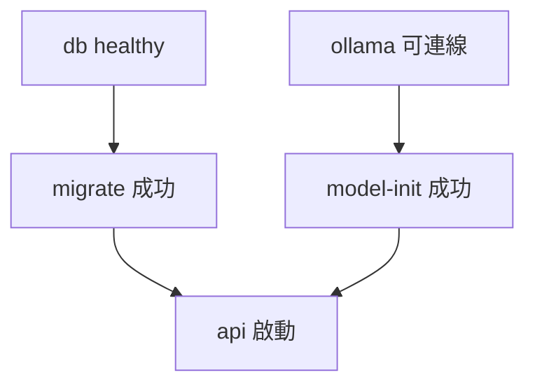
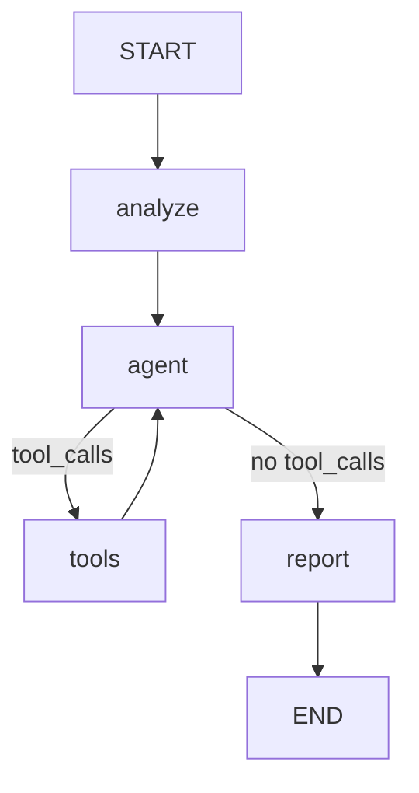

# incident-agent-runtime

[English](README.md) | 繁體中文

一個可在本機啟動的事件調查 Agent：讀取事件描述、查詢日誌證據，產生並保存可追溯來源的調查報告。

使用者提交服務異常描述後，Agent 會判斷是否需要查詢日誌、呼叫工具收集證據，再產生結構化調查報告，並將事件、報告、證據與工具呼叫紀錄保存到 PostgreSQL。整個應用透過 Docker Compose 啟動，主機不需安裝 Python、PostgreSQL 或 Ollama。

> [!IMPORTANT]
> **專案狀態：規劃中（V1 Docker Edition）。** 目前 repository 只有需求文件，尚未有程式碼。下文描述的指令、API 與行為是 V1 的**目標介面**，實作完成並實測後才會成立。標示「待補」的欄位會在驗收後填入。需求依據見 [docs/incident-agent-runtime-docker-proposal.md](docs/incident-agent-runtime-docker-proposal.md)。

> [!NOTE]
> 本版日誌來自固定 fixture，用來展示完整調查流程。報告中的假設與 `confidence` 由模型產生，**不代表根因已被證實**。

## 功能

- **事件調查 Agent**：以 LangGraph 撰寫的明確 nodes 與 routing（`analyze → agent ⇄ tools → report`）。
- **單一工具 `query_logs()`**：從固定日誌 fixture 依 service 與 keyword 讀取資料，唯讀。
- **結構化報告**：以 Pydantic 驗證報告結構。
- **證據 grounding**：報告引用的每一行 evidence 都必須完整對應這次工具實際回傳的日誌，否則調查失敗，不會默默修補。
- **可追溯保存**：報告、實際取得的 evidence 與 tool-call 紀錄存成 PostgreSQL JSONB。
- **本機推論**：透過 Ollama 執行模型（預設 CPU），模型就緒後調查過程不呼叫外部 hosted LLM。
- **一鍵啟動**：`docker compose up --build -d` 自動執行 DB migration 與模型下載。
- **測試分層**：預設測試使用 fake model，不需真實模型或 API key；真實模型驗收另外執行。

## 架構

### 技術組成

| 部分 | 選擇 |
|---|---|
| Language | Python 3.12 |
| Dependency management | uv + `uv.lock` |
| API | FastAPI + Uvicorn |
| Validation | Pydantic v2 + pydantic-settings |
| Workflow | LangGraph `StateGraph` |
| Model | LangChain chat model interface + Ollama adapter |
| Database | PostgreSQL（JSONB）、SQLAlchemy 2.x（async）+ psycopg 3 |
| Migrations | Alembic |
| Testing | pytest |
| Packaging | Dockerfile + Docker Compose v2 |
| CI | GitHub Actions |

### Compose 服務

| Service | 類型 | 說明 |
|---|---|---|
| `db` | 長期服務 | PostgreSQL，資料存於 `postgres_data` volume |
| `ollama` | 長期服務 | Ollama server，模型存於 `ollama_data` volume |
| `migrate` | 一次性任務 | 等待 DB healthy 後執行 `alembic upgrade head` |
| `model-init` | 一次性任務 | 等待 Ollama 可連線，下載並確認指定模型存在 |
| `api` | 長期服務 | 在 `migrate` 與 `model-init` 成功後啟動 Uvicorn |
| `test-db` | `test` profile | 隔離的測試用 PostgreSQL |
| `tests` | `test` profile | 執行 pytest |



API 只綁定到主機的 `127.0.0.1:8000`。DB 與 Ollama 預設不對主機開放 port。

### 調查流程



| Node | 責任 |
|---|---|
| `analyze` | 建立事件 context 與初始 messages，不額外呼叫 LLM |
| `agent` | 綁定 `query_logs`，由模型決定是否查詢、參數為何，或結束蒐證 |
| `tools` | 驗證工具名稱與參數，執行唯讀查詢，記錄 evidence 與呼叫紀錄 |
| `report` | 以事件描述與實際 evidence 產生 structured report，不綁工具、不寫 DB |

控制上限：

- 最多進入 `tools` node `MAX_TOOL_ROUNDS` 次（預設 2），每輪最多 2 個 tool calls。
- 達到上限後模型仍要求工具時，調查以 loop-limit failure 結束。
- `GRAPH_RECURSION_LIMIT` 是 graph step 的防護，與 tool rounds 是不同的限制。
- 整體調查有 deadline，單次模型請求有 timeout。

Graph nodes 不直接寫入資料庫。調查在 DB transaction 外執行，驗證通過後才以新的短 transaction 保存報告。

## 快速開始

### 需求

- Git
- 支援 Docker Compose v2 的 Docker 環境
- 首次啟動需要網路與足夠的磁碟空間（用於映像與模型下載）

### 啟動

macOS / Linux：

```bash
git clone <repository-url>
cd incident-agent-runtime
cp .env.example .env
docker compose up --build -d
```

Windows PowerShell：

```powershell
git clone <repository-url>
cd incident-agent-runtime
Copy-Item .env.example .env
docker compose up --build -d
```

### 確認初始化狀態

首次啟動需要下載模型，API 在初始化完成前可能還沒開始監聽。

```bash
# 查看所有服務狀態；migrate 與 model-init 應顯示 Exited (0)
docker compose ps -a

# 追蹤模型下載進度
docker compose logs -f model-init

# 確認應用已就緒（DB、schema、Ollama、模型都可用）
curl -f http://localhost:8000/ready
```

狀態判讀：

| 狀況 | 意義 |
|---|---|
| `model-init` 仍在執行 | 模型下載中，請等待 |
| `migrate` 或 `model-init` 以非零 exit code 結束 | 初始化失敗，`api` 不會啟動。用 `docker compose logs <service>` 查看原因 |
| `/health` 回 200，`/ready` 回 503 | API process 已啟動，但有依賴尚未就緒 |
| `/ready` 回 200 | 可以開始調查 |

首次模型下載時間：待補（依網路與硬體而定）。

就緒後開啟 Swagger UI：<http://localhost:8000/docs>

## 使用範例

### 1. 建立事件

```bash
curl -X POST http://localhost:8000/incidents \
  -H "Content-Type: application/json" \
  -d '{
    "title": "Checkout API latency spike",
    "description": "Checkout API latency increased significantly after 14:20."
  }'
```

```json
{
  "id": 1,
  "title": "Checkout API latency spike",
  "description": "Checkout API latency increased significantly after 14:20.",
  "status": "created"
}
```

### 2. 執行調查

調查在 HTTP request 期間同步完成，CPU 模式下可能需要一段時間。

```bash
curl -X POST http://localhost:8000/incidents/1/investigate
```

Agent 預期會呼叫 `query_logs(service="checkout")`，取得：

```text
14:21 checkout-api ERROR database connection timeout
14:22 checkout-api ERROR connection pool exhausted
14:24 checkout-api WARN retrying database request
```

回應範例（模型產出的文字每次可能不同）：

```json
{
  "incident_id": 1,
  "report_id": 1,
  "status": "completed",
  "report": {
    "summary": "Checkout latency may be related to database connection pool exhaustion.",
    "hypotheses": [
      {
        "cause": "Database connection pool exhaustion",
        "confidence": "high",
        "evidence": [
          "14:21 checkout-api ERROR database connection timeout",
          "14:22 checkout-api ERROR connection pool exhausted"
        ]
      }
    ],
    "recommended_next_steps": [
      "Inspect active database connections",
      "Check connection pool configuration"
    ]
  }
}
```

### 3. 查詢事件與最新報告

```bash
curl http://localhost:8000/incidents/1
```

回傳事件資訊與 `latest_report`，內容包含 report ID、建立時間、報告、實際取得的 evidence 與 tool-call 紀錄。尚未有成功報告時，`latest_report` 為 `null`。

## API

| Endpoint | 成功回應 | 說明 |
|---|---|---|
| `GET /health` | 200 | Process liveness，不呼叫模型 |
| `GET /ready` | 200 / 503 | DB 可用、migration 完成、Ollama 可連線且模型存在 |
| `POST /incidents` | 201 | 建立事件；`title`、`description` 去除前後空白後不可為空 |
| `POST /incidents/{id}/investigate` | 200 | 執行調查並保存報告 |
| `GET /incidents/{id}` | 200 | 查詢事件與最新已保存報告 |

### 錯誤回應

錯誤格式沿用 FastAPI 的 `{"detail": "..."}`。

| 狀況 | HTTP |
|---|---|
| 事件不存在 | 404 `Incident not found` |
| Request validation 失敗 | 422 |
| 應用尚未就緒 | 503 |
| 模型呼叫失敗、structured output 無效、evidence grounding 不符、未知工具或參數無效、超過 tool round 上限 | 502 |
| 調查超過 deadline | 504 |
| 非預期錯誤 | 500 |

### 調查結果規則

- 每次成功的調查都會新增一筆報告，歷史報告會保留。
- `latest_report` 是該事件 report ID 最大的報告，代表保存順序。
- 調查失敗不會新增報告，也不會改動既有報告。
- 第一次調查失敗時事件維持 `created`；已有報告的事件再次失敗時維持 `completed`。
- 沒有取得任何工具證據時，`hypotheses` 可以是空陣列。
- Schema 合法且引用存在，不代表假設在語意上正確；`confidence` 不是客觀評分。

## 日誌工具

```python
query_logs(service: str, keyword: str | None = None) -> list[str]
```

- 資料來源是映像內的 `data/logs.json`，目前包含 `checkout` 與 `payment` 兩個 service。
- 找不到 service 時回傳空清單。
- `keyword` 使用不分大小寫的子字串比對；未提供時回傳該 service 的全部日誌。
- 只做篩選，不執行 SQL、shell 或任何程式碼。

## 設定

設定來自 `.env`（由 `.env.example` 複製）：

| 變數 | 預設值 | 說明 |
|---|---|---|
| `POSTGRES_DB` | `incident_agent` | 資料庫名稱 |
| `POSTGRES_USER` | `incident_agent` | 資料庫使用者 |
| `POSTGRES_PASSWORD` | `incident_agent_dev` | 資料庫密碼 |
| `LLM_PROVIDER` | `ollama` | 本版只支援 `ollama`，其他值會在啟動時被拒絕 |
| `LLM_MODEL` | `llama3.2:3b` | Ollama 模型名稱 |
| `MAX_TOOL_ROUNDS` | `2` | 最多進入 tools node 的次數 |
| `GRAPH_RECURSION_LIMIT` | `16` | LangGraph step 上限 |
| `INVESTIGATION_TIMEOUT_SECONDS` | `300` | 整體調查 deadline |
| `LLM_REQUEST_TIMEOUT_SECONDS` | `120` | 單次模型請求 timeout |

`DATABASE_URL` 與 `OLLAMA_BASE_URL` 由 Compose 組合後傳入容器，通常不需手動設定。

> [!WARNING]
> 預設帳密只適合本機示範。`.env` 不應提交到 Git。

### 模型

`llama3.2:3b` 是初始候選模型，它在目前 Ollama 版本下的 tool calling 與 structured output 能力需要實測確認。若實測不通過，預設模型可能更換，原因會記錄在本節。

| 項目 | 值 |
|---|---|
| 已驗證模型 | 待補 |
| 模型 digest | 待補 |
| Ollama 版本 | 待補 |
| 驗收硬體 | 待補 |

模型存放在 `ollama_data` volume，不會在 build 階段打包進映像。相同的模型名稱不保證權重永遠不變，因此請以上表的 digest 為準。

## 日常操作

### 停止與恢復

```bash
docker compose down
docker compose up -d
```

`postgres_data` 與 `ollama_data` volumes 會保留。`migrate` 與 `model-init` 重新執行時不會破壞既有資料，已下載的模型會直接跳過。

### 更換模型

1. 修改 `.env` 中的 `LLM_MODEL`。
2. 重新執行模型初始化，並確認新模型下載成功：

   ```bash
   docker compose run --rm model-init
   ```

3. 重新建立 API 容器，讓它讀到新設定：

   ```bash
   docker compose up -d --force-recreate api
   ```

4. 確認 `/ready` 回傳 200。

已存在的初始化容器不一定會自動察覺 `.env` 的變動，請依上述步驟明確重新初始化。

### 重設本機環境

> [!CAUTION]
> 以下指令會刪除資料庫與模型 volumes，所有事件、報告與已下載的模型都會消失，下次啟動需重新下載模型。

```bash
docker compose down -v
```

一般重啟與 smoke test 不需要使用這個指令。

## 測試

測試分成「不使用真實模型」與「真實模型驗收」兩類。

### 預設測試（不需模型）

```bash
docker compose --profile test run --build --rm tests pytest -m "not llm"
```

- 使用 fake model 與隔離的 `test-db`，不會動到應用資料。
- 不啟動 Ollama、不下載模型、不需要任何 LLM API key。
- Build 映像與安裝依賴需要網路；測試執行時只連線內部 PostgreSQL。

涵蓋範圍：

| 層級 | 內容 |
|---|---|
| 工具與 schema | Service / keyword 查詢、報告驗證、evidence grounding 的接受與拒絕 |
| Graph control flow | 注入 scripted fake model，驗證 routing、ToolMessage 配對、evidence 累積、上限、timeout、state 隔離 |
| API + PostgreSQL | 建立 → 調查 → 查詢、歷史報告、404 / 422 / 502 / 504、失敗不覆蓋既有報告、migration 可重複執行 |

### 真實模型 smoke test

在應用就緒後執行，會透過 HTTP 建立 checkout 事件、執行調查、取回結果並驗證：

```bash
docker compose exec api python -m scripts.live_smoke
```

驗證項目：

- 模型真的呼叫了 `query_logs(service="checkout")`。
- 報告 schema 合法，至少一個 hypothesis，`recommended_next_steps` 非空。
- 所有 evidence 完整對應實際工具結果。
- 報告已保存，GET 取回的內容相同。

真實模型的推論結果有變異性。一次成功代表端到端流程可行，不代表之後每次都會成功。完整 pytest `llm` suite 的執行方式：待補。

## CI

GitHub Actions 在 PR 與 push 時執行以下檢查，全程不下載或呼叫 LLM：

1. `uv.lock` 一致性
2. Deterministic unit / graph tests
3. 真實 PostgreSQL 的 API tests
4. Runtime image build
5. Migration 與不含模型的容器 smoke check
6. `docker compose config` 驗證

## 專案結構

| 路徑 | 用途 |
|---|---|
| `app/main.py` | FastAPI composition 與 lifespan |
| `app/config.py` | 設定 |
| `app/api/` | Incident routes、liveness / readiness |
| `app/services/investigation.py` | 執行調查、驗證結果、保存報告 |
| `app/agent/` | LangGraph factory、internal state、Ollama adapters |
| `app/tools/logs.py` | `query_logs` |
| `app/schemas/` | Input、report、HTTP output schemas |
| `app/db/` | Sessions、ORM models、repositories |
| `migrations/` | Alembic revisions |
| `data/logs.json` | 固定日誌 fixture |
| `tests/` | Fakes、unit、graph、API、live-model tests |
| `scripts/` | 模型初始化、live smoke |
| `compose.yaml` | 主要服務與 `test` profile |
| `Dockerfile` | Runtime 與 test targets |
| `docs/` | Proposal、實作計畫、驗證紀錄 |

結構以實作後的 repository 為準。

## 範圍

V1 **包含**：Python API、LangGraph nodes、單一工具 `query_logs()`、固定日誌 fixture、Ollama adapter、結構化報告與 grounding 驗證、PostgreSQL persistence、Docker Compose、deterministic 與 live-model tests、GitHub Actions。

V1 **不包含**：

- TypeScript 協調服務、settle / signal-kernel 整合、revision 管理
- RAG、vector database、runbook retrieval
- 多 Agent、背景工作、Redis、Celery
- Streaming、SSE、WebSocket、frontend
- Authentication、SSO、多租戶
- 真實 log / metrics 平台與自動修復
- LangSmith、Langfuse 等外部觀測平台
- 正式環境部署、Kubernetes、production readiness
- 同一事件並行調查的結果排序或採用保證

V1 以循序調查為主。

## 開發里程碑

| 階段 | 工作 | 驗收 |
|---|---|---|
| M0 | 確認依賴版本與服務策略 | `docs/ImplementationPlan.md` 對應 proposal |
| M1 | FastAPI、settings、runtime image、DB、migration | 乾淨 DB migration、health、create / get 可用 |
| M2 | Tool、schemas、fake models、graph loop | Deterministic graph 與 grounding tests 通過 |
| M3 | Application service、investigate endpoint、persistence | Fake model 完成 API vertical slice |
| M4 | Ollama、model-init、readiness、timeouts | 乾淨 volume 初始化成功，live scenario 跑通 |
| M5 | Test profile、CI、README、驗證紀錄 | 全新 clone 重現與 restart persistence 通過 |

## 後續方向

下一階段可能以 TypeScript + settle 管理事件 revision，Python investigator 則作為 HTTP 執行服務回傳候選報告。V1 只保留 investigator 與 repository 分離的邊界，不實作相關功能。

## 文件

- [V1 Docker Edition Proposal](docs/incident-agent-runtime-docker-proposal.md)：需求與驗收標準
- `docs/ImplementationPlan.md`：實作計畫（待建立）
- `docs/Verification.md`：驗證與環境紀錄（待建立）

## 授權

本專案採用 [Apache License 2.0](LICENSE)。
