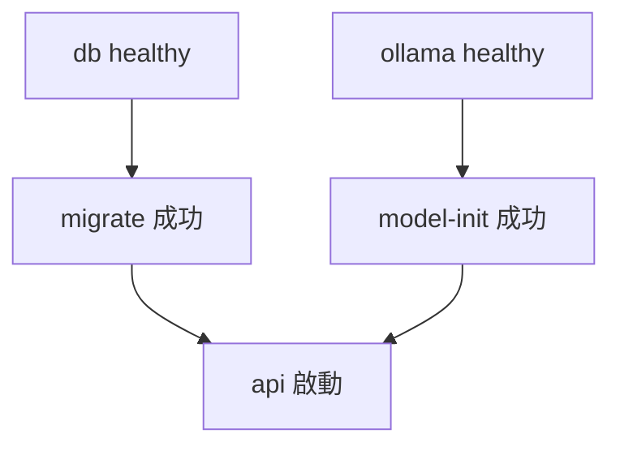
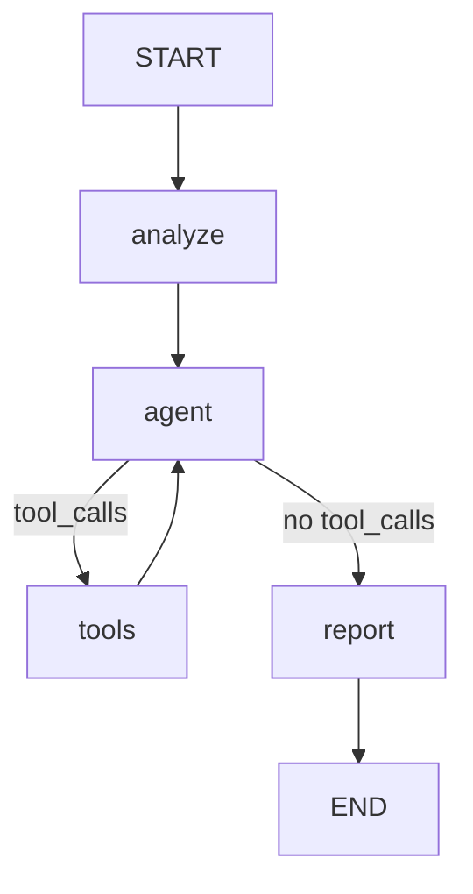

# incident-agent-runtime

[English](README.md) | 繁體中文

[](https://github.com/Luciano0322/incident-agent-runtime/actions/workflows/ci.yml)

一個可在本機啟動的事件調查 Agent：讀取事件描述、查詢日誌證據，產生並保存可追溯來源的調查報告。

使用者提交服務異常描述後，Agent 會判斷是否需要查詢日誌、呼叫工具收集證據，再產生結構化調查報告，並將事件、報告、證據與工具呼叫紀錄保存到 PostgreSQL。整個應用透過 Docker Compose 啟動，主機不需安裝 Python、PostgreSQL 或 Ollama。

> [!NOTE]
> **專案狀態：V1 Docker Edition。** Deterministic 測試在 CI 中通過；checkout 情境已在純 CPU 環境以 `qwen2.5:7b` 實際跑通。所有驗證紀錄（包含失敗）見 [docs/Verification.md](docs/Verification.md)。

> [!IMPORTANT]
> 日誌來自固定 fixture，用來展示完整調查流程。報告中的假設與 `confidence` 由模型產生，**不代表根因已被證實**。

## 功能

- **事件調查 Agent**：以 LangGraph 撰寫的明確 nodes 與 routing（`analyze → agent ⇄ tools → report`）。
- **單一工具 `query_logs()`**：從固定日誌 fixture 依 service 與 keyword 讀取資料，唯讀。
- **結構化報告**：以 Pydantic 驗證報告結構。
- **證據 grounding**：報告引用的每一行 evidence 都必須完整對應這次工具實際回傳的日誌，否則調查失敗，不會默默修補。
- **可追溯保存**：報告、實際取得的 evidence 與 tool-call 紀錄存成 PostgreSQL JSONB。
- **本機推論**：透過 Ollama 以 CPU 執行模型，模型下載完成後調查過程不呼叫外部 hosted LLM。
- **一鍵啟動**：`docker compose up --build -d` 自動執行 DB migration 與模型下載。
- **測試分層**：預設測試使用 fake model，不需真實模型或 API key；真實模型驗收另外執行。

## 架構

### 技術組成

| 部分 | 選擇 |
|---|---|
| Language | Python 3.12 |
| Dependency management | uv + `uv.lock` |
| API | FastAPI + Uvicorn |
| Validation | Pydantic v2 + pydantic-settings |
| Workflow | LangGraph `StateGraph` |
| Model | LangChain chat model interface + `langchain-ollama` |
| Database | PostgreSQL 17（JSONB）、SQLAlchemy 2.x（async）+ psycopg 3 |
| Migrations | Alembic |
| Testing | pytest |
| Packaging | Dockerfile + Docker Compose v2 |
| CI | GitHub Actions |

確切版本見 `uv.lock` 與 [docs/ImplementationPlan.md](docs/ImplementationPlan.md)。

### Compose 服務

| Service | 類型 | 說明 |
|---|---|---|
| `db` | 長期服務 | PostgreSQL，資料存於 `postgres_data` volume |
| `ollama` | 長期服務 | Ollama server（`ollama/ollama:0.35.1`），模型存於 `ollama_data` volume |
| `migrate` | 一次性任務 | 等待 DB healthy 後執行 `alembic upgrade head` |
| `model-init` | 一次性任務 | 等待 Ollama 就緒，模型不存在時下載，並確認模型可查得 |
| `api` | 長期服務 | 在 `migrate` 與 `model-init` 成功後啟動 Uvicorn |
| `test-db` | `test` profile | 隔離的測試用 PostgreSQL（資料存在記憶體） |
| `tests` | `test` profile | 執行 pytest |



API 只綁定到主機的 `127.0.0.1:8000`。DB 與 Ollama 不對主機開放 port。

### 調查流程



| Node | 責任 |
|---|---|
| `analyze` | 建立事件 context 與初始 messages，不額外呼叫 LLM |
| `agent` | 綁定 `query_logs`，由模型決定是否查詢、參數為何，或結束蒐證 |
| `tools` | 驗證工具名稱與參數，執行唯讀查詢，記錄 evidence 與呼叫紀錄 |
| `report` | 以事件描述與實際 evidence 產生 structured report，不綁工具、不寫 DB |

控制上限：

- 最多進入 `tools` node `MAX_TOOL_ROUNDS` 次（預設 2），每輪最多 2 個 tool calls。
- 達到上限後模型仍要求工具時，調查以 loop-limit failure 結束。
- `GRAPH_RECURSION_LIMIT` 是 graph step 的防護，與 tool rounds 是不同的限制。
- 整體調查有 deadline，單次模型請求有 timeout。

Graph nodes 不直接寫入資料庫。調查在 DB transaction 外執行，驗證通過後才以新的短 transaction 保存報告。

## 快速開始

### 需求

- Git
- 支援 Docker Compose v2 的 Docker 環境
- Docker 至少可使用 8 GB 記憶體（預設模型 4.7 GB）
- 首次啟動需要網路，以及約 6 GB 可用磁碟空間

### 啟動

macOS / Linux：

```bash
git clone https://github.com/Luciano0322/incident-agent-runtime.git
cd incident-agent-runtime
cp .env.example .env
docker compose up --build -d
```

Windows PowerShell：

```powershell
git clone https://github.com/Luciano0322/incident-agent-runtime.git
cd incident-agent-runtime
Copy-Item .env.example .env
docker compose up --build -d
```

`.env` 不是必要的：沒有 `.env` 時，Compose 會使用與 `.env.example` 相同的預設值。

### 確認初始化狀態

首次啟動時，`docker compose up` 會等待 `model-init` 下載模型，依網路速度需要數分鐘。初始化成功前 API 不會啟動。

```bash
# 在另一個終端機追蹤下載進度；每 10% 會印出一行
docker compose logs -f model-init

# migrate 與 model-init 應顯示 Exited (0)；db、ollama、api 應為 healthy
docker compose ps -a

# 確認應用已就緒（DB、schema、Ollama、模型都可用）
curl -f http://localhost:8000/ready
```

在 Windows PowerShell 中請改用 `curl.exe`。

狀態判讀：

| 狀況 | 意義 |
|---|---|
| `model-init` 仍在執行 | 模型下載中，請等待 |
| `migrate` 或 `model-init` 以非零 exit code 結束 | 初始化失敗，`api` 不會啟動。用 `docker compose logs <service>` 查看原因，並參考[問題排查](#問題排查) |
| `/health` 回 200，`/ready` 回 503 | API process 已啟動，但有依賴尚未就緒；回應會列出是哪一項 |
| `/ready` 回 200 | 可以開始調查 |

就緒後開啟 Swagger UI：<http://localhost:8000/docs>

## 使用範例

### 1. 建立事件

```bash
curl -X POST http://localhost:8000/incidents \
  -H "Content-Type: application/json" \
  -d '{
    "title": "Checkout API latency spike",
    "description": "Checkout API latency increased significantly after 14:20."
  }'
```

```json
{
  "id": 1,
  "title": "Checkout API latency spike",
  "description": "Checkout API latency increased significantly after 14:20.",
  "status": "created"
}
```

### 2. 執行調查

調查在 HTTP request 期間同步完成。在我們的實測中，CPU 搭配預設模型需要 100–223 秒。

```bash
curl -X POST http://localhost:8000/incidents/1/investigate
```

Agent 預期會呼叫 `query_logs(service="checkout")`，取得：

```text
14:21 checkout-api ERROR database connection timeout
14:22 checkout-api ERROR connection pool exhausted
14:24 checkout-api WARN retrying database request
```

實際紀錄的回應範例（模型產出的文字每次可能不同）：

```json
{
  "incident_id": 7,
  "report_id": 4,
  "status": "completed",
  "report": {
    "summary": "The Checkout API experienced a latency spike starting at 14:20, with errors indicating a database connection timeout and exhaustion of the connection pool. The system attempted to retry the database request, but the issue persisted.",
    "hypotheses": [
      {
        "cause": "Database connection issues leading to a connection pool exhaustion, causing API latency.",
        "confidence": "high",
        "evidence": [
          "14:21 checkout-api ERROR database connection timeout",
          "14:22 checkout-api ERROR connection pool exhausted"
        ]
      }
    ],
    "recommended_next_steps": [
      "Investigate the root cause of the database connection issues.",
      "Review and possibly increase the size of the connection pool.",
      "Monitor database performance and connection usage to prevent future issues."
    ]
  }
}
```

### 3. 查詢事件與最新報告

```bash
curl http://localhost:8000/incidents/1
```

回傳事件資訊與 `latest_report`，內容包含 report ID、建立時間、報告、實際取得的 evidence、tool-call 紀錄與模型名稱。尚未有成功報告時，`latest_report` 為 `null`。

## API

| Endpoint | 成功回應 | 說明 |
|---|---|---|
| `GET /health` | 200 | Process liveness，不呼叫模型 |
| `GET /ready` | 200 / 503 | DB 可用、migration 在最新版、Ollama 可連線且模型存在；不執行推論 |
| `POST /incidents` | 201 | 建立事件；`title`（≤ 200）、`description`（≤ 5000）去除前後空白後不可為空 |
| `POST /incidents/{id}/investigate` | 200 | 執行調查並保存報告 |
| `GET /incidents/{id}` | 200 | 查詢事件與最新已保存報告 |

### 錯誤回應

錯誤格式沿用 FastAPI 的 `{"detail": "..."}`。

| 狀況 | HTTP |
|---|---|
| 事件不存在 | 404 `Incident not found` |
| Request validation 失敗 | 422 |
| 應用尚未就緒 | 503 |
| 模型呼叫失敗、structured output 無效、evidence grounding 不符、未知工具或參數無效、超過 tool round 或 graph step 上限 | 502 |
| 調查超過 deadline | 504 |
| 非預期錯誤 | 500 |

### 調查結果規則

- 每次成功的調查都會新增一筆報告，歷史報告會保留。
- `latest_report` 是該事件 report ID 最大的報告，代表保存順序。
- 調查失敗不會新增報告，也不會改動既有報告。
- 第一次調查失敗時事件維持 `created`；已有報告的事件再次失敗時維持 `completed`。
- 沒有取得任何工具證據時，`hypotheses` 可以是空陣列。
- Schema 合法且引用存在，不代表假設在語意上正確；`confidence` 不是客觀評分。

## 日誌工具

```python
query_logs(service: str, keyword: str | None = None) -> list[str]
```

- 資料來源是映像內的 `data/logs.json`，包含 `checkout` 與 `payment` 兩個 service。
- 找不到 service 時回傳空清單。
- `keyword` 是日誌文字的子字串比對（不分大小寫），不是時間篩選；未提供時回傳該 service 的全部日誌。
- 只做篩選，不執行 SQL、shell 或任何程式碼。

## 設定

設定來自 `.env`（由 `.env.example` 複製）。沒有 `.env` 時，Compose 會使用相同的預設值。

| 變數 | 預設值 | 說明 |
|---|---|---|
| `POSTGRES_DB` | `incident_agent` | 資料庫名稱 |
| `POSTGRES_USER` | `incident_agent` | 資料庫使用者 |
| `POSTGRES_PASSWORD` | `incident_agent_dev` | 資料庫密碼；特殊字元會正確跳脫 |
| `LLM_PROVIDER` | `ollama` | 只支援 `ollama`，其他值會在啟動時被拒絕 |
| `LLM_MODEL` | `qwen2.5:7b` | Ollama 模型名稱 |
| `MAX_TOOL_ROUNDS` | `2` | 最多進入 tools node 的次數 |
| `GRAPH_RECURSION_LIMIT` | `16` | LangGraph step 上限 |
| `INVESTIGATION_TIMEOUT_SECONDS` | `600` | 整體調查 deadline |
| `LLM_REQUEST_TIMEOUT_SECONDS` | `300` | 單次模型請求 timeout |

在容器內，應用程式會由 `POSTGRES_*` 組出資料庫連線字串，並透過 `http://ollama:11434`（`OLLAMA_BASE_URL`）連線 Ollama，通常不需手動設定。

> [!WARNING]
> 預設帳密只適合本機示範。`.env` 不應提交到 Git。

### 模型

| 項目 | 值 |
|---|---|
| 預設模型 | `qwen2.5:7b`（4.7 GB，Ollama ID `845dbda0ea48`） |
| Ollama | `ollama/ollama:0.35.1` |
| 驗證環境 | Intel Core i5-13500（20 執行緒），純 CPU，Docker 可用 7.6 GB，Windows 11 + Docker Desktop |
| 實測結果 | checkout 情境 3 次中 2 次通過（100–223 秒）；失敗的那次是模型下載後的第一次呼叫，很可能碰到當時 120 秒的單次請求上限 |

proposal 最初的候選模型是 `llama3.2:3b`。它在 4 次實測中，不是把時間當成 keyword 篩選日誌，就是拿到證據後仍回傳空的 hypotheses，因此預設改為 `qwen2.5:7b`。逾時預設值也因 CPU 推論而從 120 / 300 秒調高。詳見 [docs/Verification.md](docs/Verification.md)。

模型存放在 `ollama_data` volume，不打包進映像。相同的模型名稱不保證權重永遠不變，請以上表的 ID 為準。

## 日常操作

### 停止與恢復

```bash
docker compose down
docker compose up -d
```

`postgres_data` 與 `ollama_data` volumes 會保留。`migrate` 與 `model-init` 會重新執行但不會破壞資料，已下載的模型不會重新下載。

### 更換模型

1. 在 `.env` 設定 `LLM_MODEL`。
2. 套用設定。因為 `model-init` 與 `api` 的設定改變了，Compose 會重建這兩個容器，先下載新模型再重新啟動 API：

   ```bash
   docker compose up -d
   docker compose logs model-init
   ```

3. 確認 `/ready` 回傳 200。

### 重設本機環境

> [!CAUTION]
> 以下指令會刪除資料庫與模型 volumes，所有事件、報告與已下載的模型都會消失，下次啟動需重新下載模型。

```bash
docker compose down -v
```

一般重啟與 smoke test 不需要使用這個指令。

## 測試

測試分成「不使用真實模型」與「真實模型驗收」兩類。

### 預設測試（不需模型）

```bash
docker compose --profile test run --build --rm tests
```

- 使用 fake model 與隔離的 `test-db`，不會動到應用資料。
- 不啟動 Ollama、不下載模型、不需要任何 LLM API key。測試容器的 Ollama 位址指向一個永遠無法解析的網域，任何沒被 fake 的模型呼叫都會立刻失敗。
- Build 映像與安裝依賴需要網路；測試執行時只連線內部 PostgreSQL。

涵蓋範圍：

| 層級 | 內容 |
|---|---|
| 工具與 schema | Service / keyword 查詢、報告驗證、evidence grounding 的接受與拒絕 |
| Graph control flow | 注入 scripted fake model，驗證 routing、ToolMessage 配對、evidence 累積、上限、timeout、state 隔離 |
| API + PostgreSQL | 建立 → 調查 → 查詢、歷史報告、404 / 422 / 502 / 504、失敗不覆蓋既有報告、migration 可重複執行 |
| Ollama 邊界 | 以 HTTP stub 驗證 readiness、model-init 重試、adapter 逾時與錯誤對應 |

### 真實模型驗收

需要主要服務已啟動且模型已下載。CPU 上每次需數分鐘，不在 CI 中執行。

```bash
# 對執行中的 API 做 HTTP smoke test
docker compose exec api python -m scripts.live_smoke

# 同一個情境的 pytest 版本
docker compose --profile test run --build --rm -e OLLAMA_BASE_URL=http://ollama:11434 tests pytest -m llm
```

兩者都會檢查：

- 模型真的呼叫了 `query_logs(service="checkout")`。
- 報告 schema 合法，至少一個 hypothesis，`recommended_next_steps` 非空。
- 所有引用的 evidence 完整對應實際工具結果。
- 報告已保存，GET 取回的內容相同。

真實模型的推論結果有變異性。通過一次代表端到端流程可行，不代表之後每次都會成功。請人工檢查 hypotheses 是否合理。

## CI

GitHub Actions 在每個 pull request 與 push 到 `main` 時執行，全程不下載或呼叫任何模型：

| Job | 檢查內容 |
|---|---|
| Lockfile | `uv.lock` 與 `pyproject.toml` 一致 |
| Compose config | 預設、test 與 CI 的 Compose 設定皆有效 |
| Tests | Deterministic 測試，包含對 PostgreSQL 的 API 測試 |
| Container smoke | Runtime 映像可 build；migration 可執行且可重複執行；沒有模型時 liveness 與事件 API 正常；`/ready` 回 503 |

Container smoke 使用 `compose.ci.yaml` 在沒有 Ollama 的情況下啟動 API，不是可以調查的環境。`main` 受保護：變更須透過 pull request，四個 job 全部通過後才能合併。見 [CONTRIBUTING.md](CONTRIBUTING.md)。

## 問題排查

### `model-init` 失敗並出現 `x509: certificate signed by unknown authority`

網路上的 proxy 或端點防護軟體會以自己的根憑證重新簽發 HTTPS 連線，而 Ollama 容器不信任這張根憑證。可以請 IT 將 `registry.ollama.ai` 排除在 HTTPS 檢查之外，或在本機讓 Ollama 容器信任這張根憑證：

1. 將根憑證（PEM 格式，只需公開憑證）匯出為 `certs/local-root.crt`。
2. 在 `compose.yaml` 旁建立 `compose.override.yaml`。Compose 會自動載入它，且這兩者都已被 Git 忽略：

   ```yaml
   services:
     ollama:
       image: incident-agent-runtime-ollama-local
       build:
         context: ./certs
         dockerfile_inline: |
           FROM ollama/ollama:0.35.1
           COPY local-root.crt /usr/local/share/local-ca/local-root.crt
           ENV SSL_CERT_DIR=/usr/local/share/local-ca:/etc/ssl/certs
   ```

3. 執行 `docker compose up --build -d`。

這裡把憑證 build 進本機映像，而不是用 bind mount，因為部分 Docker Desktop 環境無法讀取使用者目錄中的 bind mount。

### 調查回傳 504 或 `ReadTimeout`

CPU 執行 7B 模型很慢，重新啟動後的第一次請求還要先把模型載入記憶體。在 `.env` 調高 `INVESTIGATION_TIMEOUT_SECONDS` 與 `LLM_REQUEST_TIMEOUT_SECONDS`，再執行 `docker compose up -d`。

### 模型載入失敗或 Ollama 記憶體不足

讓 Docker 至少可使用 8 GB 記憶體（Docker Desktop：Settings → Resources），或在 `LLM_MODEL` 設定較小的模型。在我們的實測中，較小的模型 tool calling 比較不穩定。

### Windows 上 `curl` 行為不同

在 Windows PowerShell 中，`curl` 是 `Invoke-WebRequest` 的別名。請改用 `curl.exe`，送 JSON 時也可以用 `Invoke-RestMethod`。

## 專案結構

| 路徑 | 用途 |
|---|---|
| `app/main.py` | FastAPI composition 與 lifespan |
| `app/config.py` | 設定 |
| `app/api/` | Incident routes、liveness / readiness、錯誤對應 |
| `app/services/investigation.py` | 讀取事件、在 transaction 外執行調查、保存報告 |
| `app/agent/` | LangGraph investigator、prompts、grounding、Ollama chat adapter、錯誤類型 |
| `app/tools/` | `query_logs` 與 tool registry |
| `app/ollama.py` | readiness 與 model-init 使用的 Ollama model registry |
| `app/schemas/` | Input、report、HTTP output schemas |
| `app/db/` | Sessions、ORM models、repository、migration revision 檢查 |
| `migrations/` | Alembic revisions |
| `data/logs.json` | 固定日誌 fixture |
| `scripts/` | `model_init` 與 `live_smoke` |
| `tests/` | Fakes、unit、graph、API、Ollama 邊界與 live-model 測試 |
| `compose.yaml` | 主要服務與 `test` profile |
| `compose.ci.yaml` | 在沒有模型的情況下啟動 API 的 CI overlay |
| `Dockerfile` | Runtime 與 test targets |
| `.github/` | CI workflow 與 pull request 模板 |
| `docs/` | Proposal、實作計畫、TDD workflow、驗證紀錄 |

## 範圍

V1 **包含**：Python API、LangGraph nodes、單一工具 `query_logs()`、固定日誌 fixture、Ollama adapter、結構化報告與 grounding 驗證、PostgreSQL persistence、Docker Compose、deterministic 與 live-model tests、GitHub Actions。

V1 **不包含**：

- TypeScript 協調服務、settle / signal-kernel 整合、revision 管理
- RAG、vector database、runbook retrieval
- 多 Agent、背景工作、Redis、Celery
- Streaming、SSE、WebSocket、frontend
- Authentication、SSO、多租戶
- 真實 log / metrics 平台與自動修復
- LangSmith、Langfuse 等外部觀測平台
- 正式環境部署、Kubernetes、production readiness
- 同一事件並行調查的結果排序或採用保證

V1 以循序調查為主。

## 後續方向

下一階段可能以 TypeScript + settle 管理事件 revision，Python investigator 則作為 HTTP 執行服務回傳候選報告。V1 只保留 investigator 與 repository 分離的邊界，不實作相關功能。

## 文件

- [V1 Docker Edition Proposal](docs/incident-agent-runtime-docker-proposal.md)：需求與驗收標準
- [實作計畫](docs/ImplementationPlan.md)：版本、決策，以及實作與 proposal 不同之處
- [TDD Workflow](docs/TDD-Workflow.md)：里程碑、測試 seams 與 slices
- [驗證紀錄](docs/Verification.md)：環境與所有驗證執行紀錄
- [貢獻指南](CONTRIBUTING.md)：分支、pull request 與 CI（英文）

## 授權

本專案採用 [Apache License 2.0](LICENSE)。
