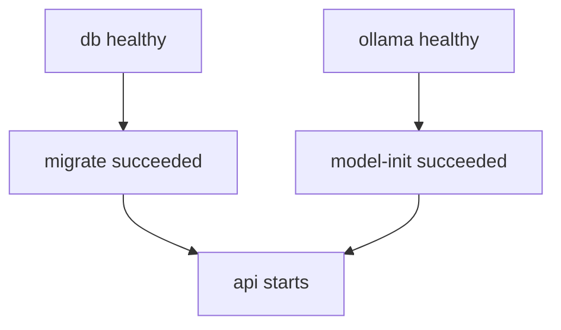
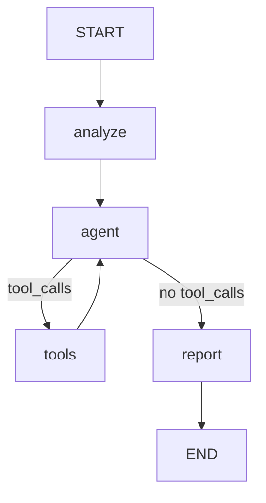

# incident-agent-runtime

English | [繁體中文](README-zhtw.md)

[](https://github.com/Luciano0322/incident-agent-runtime/actions/workflows/ci.yml)

A locally runnable incident investigation agent: it reads an incident description, queries logs for evidence, and produces and stores an investigation report whose evidence can be traced back to its source.

When a user submits a description of a service problem, the agent decides whether it needs to query logs, calls tools to collect evidence, generates a structured investigation report, and stores the incident, report, evidence, and tool-call records in PostgreSQL. The whole application starts with Docker Compose, so you do not need Python, PostgreSQL, or Ollama installed on the host.

> [!NOTE]
> **Status: V1 Docker Edition.** Deterministic tests pass in CI, and the live checkout scenario has passed with `qwen2.5:7b` on a CPU-only machine. See [docs/Verification.md](docs/Verification.md) for every recorded run, including failures.

> [!IMPORTANT]
> Logs come from a fixed fixture to demonstrate the full investigation flow. Hypotheses and `confidence` values in a report are model output and **do not mean the root cause has been confirmed**.

## Features

- **Incident investigation agent**: explicit LangGraph nodes and routing (`analyze → agent ⇄ tools → report`).
- **A single tool, `query_logs()`**: reads a fixed log fixture by service and keyword. Read-only.
- **Structured reports**: report structure is validated with Pydantic.
- **Evidence grounding**: every evidence line cited in a report must exactly match a log line the tool actually returned during this investigation. Otherwise the investigation fails; the report is never silently patched.
- **Traceable storage**: the report, the evidence actually collected, and the tool-call records are stored as PostgreSQL JSONB.
- **Local inference**: models run through Ollama on CPU. Once the model is downloaded, investigations do not call any external hosted LLM.
- **One-command startup**: `docker compose up --build -d` runs database migrations and downloads the model automatically.
- **Layered tests**: default tests use a fake model and need no real model or API key; real-model verification runs separately.

## Architecture

### Stack

| Part | Choice |
|---|---|
| Language | Python 3.12 |
| Dependency management | uv + `uv.lock` |
| API | FastAPI + Uvicorn |
| Validation | Pydantic v2 + pydantic-settings |
| Workflow | LangGraph `StateGraph` |
| Model | LangChain chat model interface + `langchain-ollama` |
| Database | PostgreSQL 17 (JSONB), SQLAlchemy 2.x (async) + psycopg 3 |
| Migrations | Alembic |
| Testing | pytest |
| Packaging | Dockerfile + Docker Compose v2 |
| CI | GitHub Actions |

Exact versions are in `uv.lock` and [docs/ImplementationPlan.md](docs/ImplementationPlan.md).

### Compose services

| Service | Type | Description |
|---|---|---|
| `db` | Long-running | PostgreSQL; data stored in the `postgres_data` volume |
| `ollama` | Long-running | Ollama server (`ollama/ollama:0.35.1`); models stored in the `ollama_data` volume |
| `migrate` | One-off task | Waits for a healthy DB, then runs `alembic upgrade head` |
| `model-init` | One-off task | Waits for Ollama, pulls the configured model if missing, and verifies it is listed |
| `api` | Long-running | Starts Uvicorn after `migrate` and `model-init` succeed |
| `test-db` | `test` profile | Isolated PostgreSQL for tests (in memory) |
| `tests` | `test` profile | Runs pytest |



The API is bound to `127.0.0.1:8000` on the host only. The DB and Ollama ports are not exposed to the host.

### Investigation flow



| Node | Responsibility |
|---|---|
| `analyze` | Builds the incident context and initial messages; makes no extra LLM call |
| `agent` | Has `query_logs` bound; the model decides whether to query, which arguments to use, or when to stop collecting evidence |
| `tools` | Validates the tool name and arguments, runs the read-only query, records evidence and call metadata |
| `report` | Produces a structured report from the incident description and the actual evidence; no tools bound, no DB writes |

Limits:

- The `tools` node is entered at most `MAX_TOOL_ROUNDS` times (default 2), with at most 2 tool calls per round.
- If the model still requests tools after a limit is reached, the investigation ends with a loop-limit failure.
- `GRAPH_RECURSION_LIMIT` guards graph steps and is a separate limit from tool rounds.
- The whole investigation has a deadline, and each model request has its own timeout.

Graph nodes never write to the database. The investigation runs outside any DB transaction; the report is saved in a new short transaction only after validation passes.

## Quick start

### Requirements

- Git
- Docker with Docker Compose v2
- At least 8 GB of memory available to Docker (the default model is 4.7 GB)
- Network access and about 6 GB of free disk space for the first start

### Start

macOS / Linux:

```bash
git clone https://github.com/Luciano0322/incident-agent-runtime.git
cd incident-agent-runtime
cp .env.example .env
docker compose up --build -d
```

Windows PowerShell:

```powershell
git clone https://github.com/Luciano0322/incident-agent-runtime.git
cd incident-agent-runtime
Copy-Item .env.example .env
docker compose up --build -d
```

`.env` is optional: Compose falls back to the same defaults as `.env.example`.

### Check initialization status

On the first start, `docker compose up` waits while `model-init` downloads the model, which takes several minutes depending on your network. The API does not start until initialization succeeds.

```bash
# Follow the download in another terminal; it logs progress every 10%
docker compose logs -f model-init

# migrate and model-init should show Exited (0); db, ollama, api should be healthy
docker compose ps -a

# Confirm the app is ready (DB, schema, Ollama, and model all available)
curl -f http://localhost:8000/ready
```

On Windows PowerShell, use `curl.exe` instead of `curl`.

How to read the status:

| What you see | Meaning |
|---|---|
| `model-init` still running | The model is downloading; wait |
| `migrate` or `model-init` exited with a non-zero code | Initialization failed and `api` will not start. Run `docker compose logs <service>` and see [Troubleshooting](#troubleshooting) |
| `/health` returns 200, `/ready` returns 503 | The API process is up, but a dependency is not ready; the response lists which one |
| `/ready` returns 200 | Ready to investigate |

Once ready, open Swagger UI: <http://localhost:8000/docs>

## Usage example

### 1. Create an incident

```bash
curl -X POST http://localhost:8000/incidents \
  -H "Content-Type: application/json" \
  -d '{
    "title": "Checkout API latency spike",
    "description": "Checkout API latency increased significantly after 14:20."
  }'
```

```json
{
  "id": 1,
  "title": "Checkout API latency spike",
  "description": "Checkout API latency increased significantly after 14:20.",
  "status": "created"
}
```

### 2. Run an investigation

The investigation completes within the HTTP request. On CPU with the default model this took 100–223 seconds in our runs.

```bash
curl -X POST http://localhost:8000/incidents/1/investigate
```

The agent is expected to call `query_logs(service="checkout")` and get:

```text
14:21 checkout-api ERROR database connection timeout
14:22 checkout-api ERROR connection pool exhausted
14:24 checkout-api WARN retrying database request
```

Example response from a recorded run (the model's wording varies between runs):

```json
{
  "incident_id": 7,
  "report_id": 4,
  "status": "completed",
  "report": {
    "summary": "The Checkout API experienced a latency spike starting at 14:20, with errors indicating a database connection timeout and exhaustion of the connection pool. The system attempted to retry the database request, but the issue persisted.",
    "hypotheses": [
      {
        "cause": "Database connection issues leading to a connection pool exhaustion, causing API latency.",
        "confidence": "high",
        "evidence": [
          "14:21 checkout-api ERROR database connection timeout",
          "14:22 checkout-api ERROR connection pool exhausted"
        ]
      }
    ],
    "recommended_next_steps": [
      "Investigate the root cause of the database connection issues.",
      "Review and possibly increase the size of the connection pool.",
      "Monitor database performance and connection usage to prevent future issues."
    ]
  }
}
```

### 3. Get the incident and its latest report

```bash
curl http://localhost:8000/incidents/1
```

Returns the incident and `latest_report`, which includes the report ID, creation time, the report, the evidence actually collected, the tool-call records, and the model name. `latest_report` is `null` until a report has been saved successfully.

## API

| Endpoint | Success | Description |
|---|---|---|
| `GET /health` | 200 | Process liveness; does not call the model |
| `GET /ready` | 200 / 503 | DB available, migrations at head, Ollama reachable, and model present; never runs inference |
| `POST /incidents` | 201 | Create an incident; `title` (≤ 200) and `description` (≤ 5000) must be non-empty after trimming whitespace |
| `POST /incidents/{id}/investigate` | 200 | Run an investigation and save the report |
| `GET /incidents/{id}` | 200 | Get the incident and its latest saved report |

### Error responses

Errors use FastAPI's `{"detail": "..."}` format.

| Situation | HTTP |
|---|---|
| Incident not found | 404 `Incident not found` |
| Request validation failed | 422 |
| App not ready | 503 |
| Model call failure, invalid structured output, evidence grounding violation, unknown tool or invalid arguments, tool-round or graph-step limit exceeded | 502 |
| Investigation deadline exceeded | 504 |
| Unexpected error | 500 |

### Investigation result rules

- Each successful investigation adds a new report; earlier reports are kept.
- `latest_report` is the report with the highest report ID for that incident, which reflects save order.
- A failed investigation adds no report and does not change existing reports.
- If the first investigation fails, the incident stays `created`; if an incident that already has a report fails again, it stays `completed`.
- If no tool evidence was collected, `hypotheses` may be an empty list.
- A valid schema with real citations does not mean a hypothesis is semantically correct; `confidence` is not an objective score.

## Log tool

```python
query_logs(service: str, keyword: str | None = None) -> list[str]
```

- Data comes from `data/logs.json` inside the image, which has two services: `checkout` and `payment`.
- An unknown service returns an empty list.
- `keyword` is a case-insensitive substring of the line text, not a time filter; without it, all lines for the service are returned.
- It only filters lines; it never runs SQL, shell commands, or any code.

## Configuration

Settings come from `.env` (copied from `.env.example`). Compose uses the same values as defaults when `.env` is missing.

| Variable | Default | Description |
|---|---|---|
| `POSTGRES_DB` | `incident_agent` | Database name |
| `POSTGRES_USER` | `incident_agent` | Database user |
| `POSTGRES_PASSWORD` | `incident_agent_dev` | Database password; special characters are escaped correctly |
| `LLM_PROVIDER` | `ollama` | Only `ollama` is supported; other values are rejected at startup |
| `LLM_MODEL` | `qwen2.5:7b` | Ollama model name |
| `MAX_TOOL_ROUNDS` | `2` | Maximum number of times the tools node is entered |
| `GRAPH_RECURSION_LIMIT` | `16` | LangGraph step limit |
| `INVESTIGATION_TIMEOUT_SECONDS` | `600` | Overall investigation deadline |
| `LLM_REQUEST_TIMEOUT_SECONDS` | `300` | Timeout for a single model request |

Inside the containers, the app builds the database URL from the `POSTGRES_*` values and reaches Ollama at `http://ollama:11434` (`OLLAMA_BASE_URL`). You normally don't need to set either.

> [!WARNING]
> The default credentials are for local demos only. Do not commit `.env` to Git.

### Model

| Item | Value |
|---|---|
| Default model | `qwen2.5:7b` (4.7 GB, Ollama ID `845dbda0ea48`) |
| Ollama | `ollama/ollama:0.35.1` |
| Verified on | Intel Core i5-13500 (20 threads), CPU only, 7.6 GB for Docker, Windows 11 + Docker Desktop |
| Live result | 3 of 4 checkout runs passed (100–223 s), including one from a fresh clone; the failed one was the first call after the download and most likely hit the old 120 s request timeout |

The proposal started with `llama3.2:3b`. In four live runs it either filtered logs by a timestamp or returned no hypotheses even with evidence, so the default moved to `qwen2.5:7b`. The timeouts were raised from 120 s / 300 s for CPU inference. Details are in [docs/Verification.md](docs/Verification.md).

Models are stored in the `ollama_data` volume, not baked into the image. The same model name does not guarantee the same weights forever, so treat the ID above as the reference.

## Day-to-day operations

### Stop and resume

```bash
docker compose down
docker compose up -d
```

The `postgres_data` and `ollama_data` volumes are kept. `migrate` and `model-init` run again without damaging data, and an already downloaded model is not downloaded again.

### Change the model

1. Set `LLM_MODEL` in `.env`.
2. Apply it. Compose recreates `model-init` and `api` because their settings changed, so the new model is pulled before the API restarts:

   ```bash
   docker compose up -d
   docker compose logs model-init
   ```

3. Confirm `/ready` returns 200.

### Reset the local environment

> [!CAUTION]
> This deletes the database and model volumes. All incidents, reports, and downloaded models are lost, and the model will be downloaded again on the next start.

```bash
docker compose down -v
```

You don't need this command for normal restarts or smoke tests.

## Testing

Tests are split into runs without a real model and real-model verification.

### Default tests (no model needed)

```bash
docker compose --profile test run --build --rm tests
```

- Uses a fake model and the isolated `test-db`; application data is never touched.
- Does not start Ollama, download a model, or need any LLM API key. The test container points Ollama at an address that never resolves, so a model call that is not faked fails at once.
- Building images and installing dependencies needs network access; during the test run itself, only the internal PostgreSQL connection is used.

Coverage:

| Level | What is tested |
|---|---|
| Tools and schemas | Service / keyword queries, report validation, evidence grounding accept and reject cases |
| Graph control flow | With a scripted fake model: routing, ToolMessage pairing, evidence accumulation, limits, timeouts, state isolation |
| API + PostgreSQL | Create → investigate → get, report history, 404 / 422 / 502 / 504, failures not overwriting existing reports, re-runnable migrations |
| Ollama boundary | Readiness, model-init retries, adapter timeouts and error mapping, using HTTP stubs |

### Real-model checks

These need the main stack running with the model downloaded. They take minutes on CPU and are not part of CI.

```bash
# HTTP smoke test against the running API
docker compose exec api python -m scripts.live_smoke

# The same scenario as a pytest test
docker compose --profile test run --build --rm -e OLLAMA_BASE_URL=http://ollama:11434 tests pytest -m llm
```

Both check that:

- The model actually called `query_logs(service="checkout")`.
- The report schema is valid, with at least one hypothesis and non-empty `recommended_next_steps`.
- All cited evidence exactly matches the actual tool output.
- The report was saved, and GET returns the same content.

Real-model output varies between runs. A pass shows the end-to-end flow works; it does not mean every future run will succeed. Review the hypotheses by hand.

## CI

GitHub Actions runs on every pull request and push to `main`, without pulling or calling any model:

| Job | Checks |
|---|---|
| Lockfile | `uv.lock` matches `pyproject.toml` |
| Compose config | Default, test, and CI Compose files are valid |
| Tests | Deterministic tests, including API tests against PostgreSQL |
| Container smoke | Runtime image builds; migrations run and re-run; liveness and the incident API work without a model; `/ready` reports 503 |

The container smoke uses `compose.ci.yaml`, which starts the API without Ollama. It is not a working investigation setup. `main` is protected: changes merge through pull requests once all four jobs pass. See [CONTRIBUTING.md](CONTRIBUTING.md).

## Troubleshooting

### `model-init` fails with `x509: certificate signed by unknown authority`

A proxy or endpoint security product on your network re-signs HTTPS traffic, and the Ollama container does not trust its root certificate. Ask your IT team to exclude `registry.ollama.ai` from HTTPS inspection, or make the Ollama container trust that root certificate locally:

1. Export the root certificate (PEM, public certificate only) to `certs/local-root.crt`.
2. Create `compose.override.yaml` next to `compose.yaml`. Compose loads it automatically, and both files are ignored by Git:

   ```yaml
   services:
     ollama:
       image: incident-agent-runtime-ollama-local
       build:
         context: ./certs
         dockerfile_inline: |
           FROM ollama/ollama:0.35.1
           COPY local-root.crt /usr/local/share/local-ca/local-root.crt
           ENV SSL_CERT_DIR=/usr/local/share/local-ca:/etc/ssl/certs
   ```

3. Run `docker compose up --build -d`.

The certificate is built into a local image rather than bind-mounted because some Docker Desktop setups cannot read bind mounts from the user profile.

### The investigation returns 504 or a `ReadTimeout`

CPU inference with a 7B model is slow, and the first request after a restart also loads the model into memory. Raise `INVESTIGATION_TIMEOUT_SECONDS` and `LLM_REQUEST_TIMEOUT_SECONDS` in `.env`, then run `docker compose up -d`.

### The model fails to load or Ollama runs out of memory

Give Docker at least 8 GB of memory (Docker Desktop: Settings → Resources), or set a smaller model in `LLM_MODEL`. Smaller models were less reliable at tool calling in our runs.

### `curl` behaves differently on Windows

In Windows PowerShell, `curl` is an alias for `Invoke-WebRequest`. Use `curl.exe`, or `Invoke-RestMethod` for JSON requests.

### A command looks stuck on Windows

Clicking inside a Windows console window starts text selection (QuickEdit), which pauses any program that writes to that window. If a long command such as `pytest -m llm` stops updating, press `Enter` or `Esc` to release it.

## Project structure

| Path | Purpose |
|---|---|
| `app/main.py` | FastAPI composition and lifespan |
| `app/config.py` | Settings |
| `app/api/` | Incident routes, liveness / readiness, error mapping |
| `app/services/investigation.py` | Loads the incident, runs the investigation outside a transaction, saves the report |
| `app/agent/` | LangGraph investigator, prompts, grounding, Ollama chat adapters, error types |
| `app/tools/` | `query_logs` and the tool registry |
| `app/ollama.py` | Ollama model registry used by readiness and model-init |
| `app/schemas/` | Input, report, and HTTP output schemas |
| `app/db/` | Sessions, ORM models, repository, migration revision checks |
| `migrations/` | Alembic revisions |
| `data/logs.json` | Fixed log fixture |
| `scripts/` | `model_init` and `live_smoke` |
| `tests/` | Fakes, unit, graph, API, Ollama boundary, and live-model tests |
| `compose.yaml` | Main services and the `test` profile |
| `compose.ci.yaml` | CI overlay that starts the API without a model |
| `Dockerfile` | Runtime and test targets |
| `.github/` | CI workflow and pull request template |
| `docs/` | Proposal, implementation plan, TDD workflow, verification records |

## Scope

V1 **includes**: the Python API, LangGraph nodes, the single `query_logs()` tool, the fixed log fixture, the Ollama adapter, structured reports with grounding validation, PostgreSQL persistence, Docker Compose, deterministic and live-model tests, and GitHub Actions.

V1 **does not include**:

- A TypeScript coordination service, settle / signal-kernel integration, or revision management
- RAG, vector databases, or runbook retrieval
- Multiple agents, background jobs, Redis, or Celery
- Streaming, SSE, WebSocket, or a frontend
- Authentication, SSO, or multi-tenancy
- Real log / metrics platforms or automated remediation
- External observability platforms such as LangSmith or Langfuse
- Production deployment, Kubernetes, or production readiness
- Ordering or adoption guarantees for concurrent investigations of the same incident

V1 focuses on sequential investigations.

## Future direction

A later phase may use TypeScript + settle to manage incident revisions, with the Python investigator running as an HTTP execution service that returns candidate reports. V1 only keeps the investigator and repository separate and does not implement any of this.

## Documentation

- [V1 Docker Edition Proposal](docs/incident-agent-runtime-docker-proposal.md): requirements and acceptance criteria
- [Implementation Plan](docs/ImplementationPlan.md): versions, decisions, and where the implementation differs from the proposal
- [TDD Workflow](docs/TDD-Workflow.md): milestones, test seams, and slices
- [Verification](docs/Verification.md): environment and every recorded verification run
- [Contributing](CONTRIBUTING.md): branches, pull requests, and CI

The documents under `docs/` are written in Traditional Chinese.

## License

This project is licensed under the [Apache License 2.0](LICENSE).
