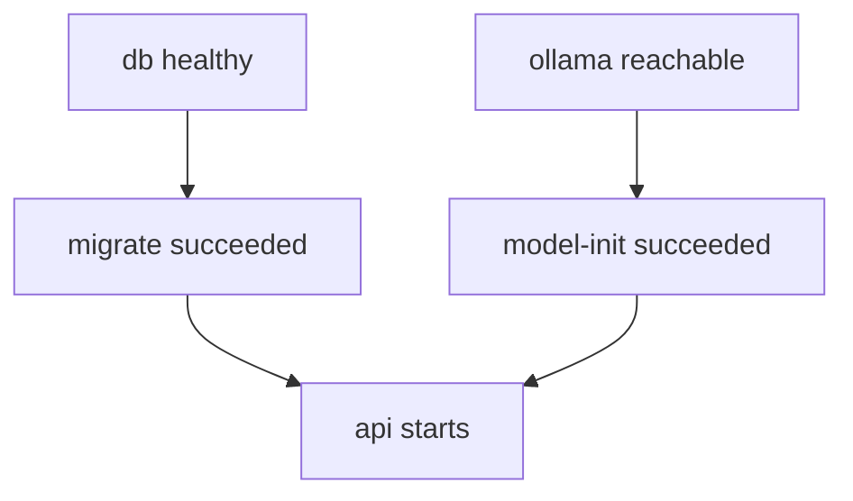
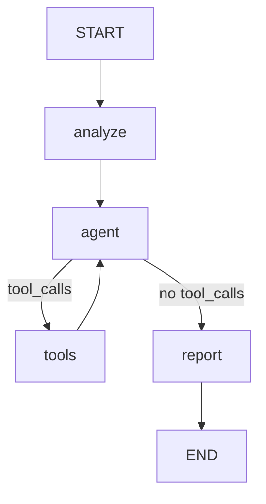

# incident-agent-runtime

English | [繁體中文](README-zhtw.md)

A locally runnable incident investigation agent: it reads an incident description, queries logs for evidence, and produces and stores an investigation report whose evidence can be traced back to its source.

When a user submits a description of a service problem, the agent decides whether it needs to query logs, calls tools to collect evidence, generates a structured investigation report, and stores the incident, report, evidence, and tool-call records in PostgreSQL. The whole application starts with Docker Compose, so you do not need Python, PostgreSQL, or Ollama installed on the host.

> [!IMPORTANT]
> **Status: planning (V1 Docker Edition).** The repository currently contains only the requirements document; there is no code yet. The commands, API, and behavior described below are the V1 **target interface** and will only hold once implemented and tested. Fields marked "TBD" will be filled in after verification. See [docs/incident-agent-runtime-docker-proposal.md](docs/incident-agent-runtime-docker-proposal.md) for the requirements.

> [!NOTE]
> In this version, logs come from a fixed fixture to demonstrate the full investigation flow. Hypotheses and `confidence` values in a report are model output and **do not mean the root cause has been confirmed**.

## Features

- **Incident investigation agent**: explicit LangGraph nodes and routing (`analyze → agent ⇄ tools → report`).
- **A single tool, `query_logs()`**: reads a fixed log fixture by service and keyword. Read-only.
- **Structured reports**: report structure is validated with Pydantic.
- **Evidence grounding**: every evidence line cited in a report must exactly match a log line the tool actually returned during this investigation. Otherwise the investigation fails; the report is never silently patched.
- **Traceable storage**: the report, the evidence actually collected, and the tool-call records are stored as PostgreSQL JSONB.
- **Local inference**: models run through Ollama (CPU by default). Once the model is ready, investigations do not call any external hosted LLM.
- **One-command startup**: `docker compose up --build -d` runs database migrations and downloads the model automatically.
- **Layered tests**: default tests use a fake model and need no real model or API key; real-model verification runs separately.

## Architecture

### Stack

| Part | Choice |
|---|---|
| Language | Python 3.12 |
| Dependency management | uv + `uv.lock` |
| API | FastAPI + Uvicorn |
| Validation | Pydantic v2 + pydantic-settings |
| Workflow | LangGraph `StateGraph` |
| Model | LangChain chat model interface + Ollama adapter |
| Database | PostgreSQL (JSONB), SQLAlchemy 2.x (async) + psycopg 3 |
| Migrations | Alembic |
| Testing | pytest |
| Packaging | Dockerfile + Docker Compose v2 |
| CI | GitHub Actions |

### Compose services

| Service | Type | Description |
|---|---|---|
| `db` | Long-running | PostgreSQL; data stored in the `postgres_data` volume |
| `ollama` | Long-running | Ollama server; models stored in the `ollama_data` volume |
| `migrate` | One-off task | Waits for a healthy DB, then runs `alembic upgrade head` |
| `model-init` | One-off task | Waits for Ollama to be reachable, then pulls and verifies the configured model |
| `api` | Long-running | Starts Uvicorn after `migrate` and `model-init` succeed |
| `test-db` | `test` profile | Isolated PostgreSQL for tests |
| `tests` | `test` profile | Runs pytest |



The API is bound to `127.0.0.1:8000` on the host only. The DB and Ollama ports are not exposed to the host by default.

### Investigation flow



| Node | Responsibility |
|---|---|
| `analyze` | Builds the incident context and initial messages; makes no extra LLM call |
| `agent` | Has `query_logs` bound; the model decides whether to query, which arguments to use, or when to stop collecting evidence |
| `tools` | Validates the tool name and arguments, runs the read-only query, records evidence and call metadata |
| `report` | Produces a structured report from the incident description and the actual evidence; no tools bound, no DB writes |

Limits:

- The `tools` node is entered at most `MAX_TOOL_ROUNDS` times (default 2), with at most 2 tool calls per round.
- If the model still requests tools after the limit is reached, the investigation ends with a loop-limit failure.
- `GRAPH_RECURSION_LIMIT` guards graph steps and is a separate limit from tool rounds.
- The whole investigation has a deadline, and each model request has its own timeout.

Graph nodes never write to the database. The investigation runs outside any DB transaction; the report is saved in a new short transaction only after validation passes.

## Quick start

### Requirements

- Git
- Docker with Docker Compose v2
- Network access and enough disk space for the first start (images and model download)

### Start

macOS / Linux:

```bash
git clone <repository-url>
cd incident-agent-runtime
cp .env.example .env
docker compose up --build -d
```

Windows PowerShell:

```powershell
git clone <repository-url>
cd incident-agent-runtime
Copy-Item .env.example .env
docker compose up --build -d
```

### Check initialization status

The first start has to download the model, and the API may not be listening until initialization finishes.

```bash
# Show all services; migrate and model-init should show Exited (0)
docker compose ps -a

# Follow the model download
docker compose logs -f model-init

# Confirm the app is ready (DB, schema, Ollama, and model all available)
curl -f http://localhost:8000/ready
```

How to read the status:

| What you see | Meaning |
|---|---|
| `model-init` still running | The model is downloading; wait |
| `migrate` or `model-init` exited with a non-zero code | Initialization failed and `api` will not start. Run `docker compose logs <service>` to see why |
| `/health` returns 200, `/ready` returns 503 | The API process is up, but a dependency is not ready yet |
| `/ready` returns 200 | Ready to investigate |

First model download time: TBD (depends on network and hardware).

Once ready, open Swagger UI: <http://localhost:8000/docs>

## Usage example

### 1. Create an incident

```bash
curl -X POST http://localhost:8000/incidents \
  -H "Content-Type: application/json" \
  -d '{
    "title": "Checkout API latency spike",
    "description": "Checkout API latency increased significantly after 14:20."
  }'
```

```json
{
  "id": 1,
  "title": "Checkout API latency spike",
  "description": "Checkout API latency increased significantly after 14:20.",
  "status": "created"
}
```

### 2. Run an investigation

The investigation completes within the HTTP request, which can take a while in CPU mode.

```bash
curl -X POST http://localhost:8000/incidents/1/investigate
```

The agent is expected to call `query_logs(service="checkout")` and get:

```text
14:21 checkout-api ERROR database connection timeout
14:22 checkout-api ERROR connection pool exhausted
14:24 checkout-api WARN retrying database request
```

Example response (the model's wording can vary between runs):

```json
{
  "incident_id": 1,
  "report_id": 1,
  "status": "completed",
  "report": {
    "summary": "Checkout latency may be related to database connection pool exhaustion.",
    "hypotheses": [
      {
        "cause": "Database connection pool exhaustion",
        "confidence": "high",
        "evidence": [
          "14:21 checkout-api ERROR database connection timeout",
          "14:22 checkout-api ERROR connection pool exhausted"
        ]
      }
    ],
    "recommended_next_steps": [
      "Inspect active database connections",
      "Check connection pool configuration"
    ]
  }
}
```

### 3. Get the incident and its latest report

```bash
curl http://localhost:8000/incidents/1
```

Returns the incident and `latest_report`, which includes the report ID, creation time, the report, the evidence actually collected, and the tool-call records. `latest_report` is `null` until a report has been saved successfully.

## API

| Endpoint | Success | Description |
|---|---|---|
| `GET /health` | 200 | Process liveness; does not call the model |
| `GET /ready` | 200 / 503 | DB available, migrations applied, Ollama reachable, and model present |
| `POST /incidents` | 201 | Create an incident; `title` and `description` must be non-empty after trimming whitespace |
| `POST /incidents/{id}/investigate` | 200 | Run an investigation and save the report |
| `GET /incidents/{id}` | 200 | Get the incident and its latest saved report |

### Error responses

Errors use FastAPI's `{"detail": "..."}` format.

| Situation | HTTP |
|---|---|
| Incident not found | 404 `Incident not found` |
| Request validation failed | 422 |
| App not ready | 503 |
| Model call failure, invalid structured output, evidence grounding violation, unknown tool or invalid arguments, tool-round limit exceeded | 502 |
| Investigation deadline exceeded | 504 |
| Unexpected error | 500 |

### Investigation result rules

- Each successful investigation adds a new report; earlier reports are kept.
- `latest_report` is the report with the highest report ID for that incident, which reflects save order.
- A failed investigation adds no report and does not change existing reports.
- If the first investigation fails, the incident stays `created`; if an incident that already has a report fails again, it stays `completed`.
- If no tool evidence was collected, `hypotheses` may be an empty list.
- A valid schema with real citations does not mean a hypothesis is semantically correct; `confidence` is not an objective score.

## Log tool

```python
query_logs(service: str, keyword: str | None = None) -> list[str]
```

- Data comes from `data/logs.json` inside the image, which currently has two services: `checkout` and `payment`.
- An unknown service returns an empty list.
- `keyword` is a case-insensitive substring match; without it, all logs for the service are returned.
- It only filters lines; it never runs SQL, shell commands, or any code.

## Configuration

Settings come from `.env` (copied from `.env.example`):

| Variable | Default | Description |
|---|---|---|
| `POSTGRES_DB` | `incident_agent` | Database name |
| `POSTGRES_USER` | `incident_agent` | Database user |
| `POSTGRES_PASSWORD` | `incident_agent_dev` | Database password |
| `LLM_PROVIDER` | `ollama` | Only `ollama` is supported in this version; other values are rejected at startup |
| `LLM_MODEL` | `llama3.2:3b` | Ollama model name |
| `MAX_TOOL_ROUNDS` | `2` | Maximum number of times the tools node is entered |
| `GRAPH_RECURSION_LIMIT` | `16` | LangGraph step limit |
| `INVESTIGATION_TIMEOUT_SECONDS` | `300` | Overall investigation deadline |
| `LLM_REQUEST_TIMEOUT_SECONDS` | `120` | Timeout for a single model request |

`DATABASE_URL` and `OLLAMA_BASE_URL` are assembled by Compose and passed into the containers; you normally don't need to set them.

> [!WARNING]
> The default credentials are for local demos only. Do not commit `.env` to Git.

### Model

`llama3.2:3b` is the initial candidate. Its tool calling and structured output support with the current Ollama version still needs to be verified. If it does not pass, the default model may change, and the reason will be recorded in this section.

| Item | Value |
|---|---|
| Verified model | TBD |
| Model digest | TBD |
| Ollama version | TBD |
| Verification hardware | TBD |

Models are stored in the `ollama_data` volume and are not baked into the image at build time. The same model name does not guarantee the same weights forever, so treat the digest in the table above as the reference.

## Day-to-day operations

### Stop and resume

```bash
docker compose down
docker compose up -d
```

The `postgres_data` and `ollama_data` volumes are kept. Re-running `migrate` and `model-init` does not damage existing data, and an already downloaded model is skipped.

### Change the model

1. Update `LLM_MODEL` in `.env`.
2. Re-run model initialization and confirm the new model downloaded successfully:

   ```bash
   docker compose run --rm model-init
   ```

3. Recreate the API container so it picks up the new setting:

   ```bash
   docker compose up -d --force-recreate api
   ```

4. Confirm `/ready` returns 200.

Existing initialization containers may not notice changes to `.env` automatically, so re-initialize explicitly using the steps above.

### Reset the local environment

> [!CAUTION]
> This deletes the database and model volumes. All incidents, reports, and downloaded models are lost, and the model will be downloaded again on the next start.

```bash
docker compose down -v
```

You don't need this command for normal restarts or smoke tests.

## Testing

Tests are split into runs without a real model and real-model verification.

### Default tests (no model needed)

```bash
docker compose --profile test run --build --rm tests pytest -m "not llm"
```

- Uses a fake model and the isolated `test-db`; application data is never touched.
- Does not start Ollama, download a model, or need any LLM API key.
- Building images and installing dependencies needs network access; during the test run itself, only the internal PostgreSQL connection is used.

Coverage:

| Level | What is tested |
|---|---|
| Tools and schemas | Service / keyword queries, report validation, evidence grounding accept and reject cases |
| Graph control flow | With a scripted fake model: routing, ToolMessage pairing, evidence accumulation, limits, timeouts, state isolation |
| API + PostgreSQL | Create → investigate → get, report history, 404 / 422 / 502 / 504, failures not overwriting existing reports, re-runnable migrations |

### Real-model smoke test

Run this once the app is ready. It creates a checkout incident over HTTP, runs an investigation, fetches the result, and verifies it:

```bash
docker compose exec api python -m scripts.live_smoke
```

It checks that:

- The model actually called `query_logs(service="checkout")`.
- The report schema is valid, with at least one hypothesis and non-empty `recommended_next_steps`.
- All evidence exactly matches the actual tool output.
- The report was saved, and GET returns the same content.

Real-model output varies between runs. One success shows the end-to-end flow works; it does not mean every future run will succeed. How to run the full pytest `llm` suite: TBD.

## CI

GitHub Actions runs these checks on PRs and pushes, without pulling or calling any LLM:

1. `uv.lock` consistency
2. Deterministic unit / graph tests
3. API tests against real PostgreSQL
4. Runtime image build
5. Migration and a container smoke check without a model
6. `docker compose config` validation

## Project structure

| Path | Purpose |
|---|---|
| `app/main.py` | FastAPI composition and lifespan |
| `app/config.py` | Settings |
| `app/api/` | Incident routes, liveness / readiness |
| `app/services/investigation.py` | Runs the investigation, validates results, saves the report |
| `app/agent/` | LangGraph factory, internal state, Ollama adapters |
| `app/tools/logs.py` | `query_logs` |
| `app/schemas/` | Input, report, and HTTP output schemas |
| `app/db/` | Sessions, ORM models, repositories |
| `migrations/` | Alembic revisions |
| `data/logs.json` | Fixed log fixture |
| `tests/` | Fakes, unit, graph, API, and live-model tests |
| `scripts/` | Model initialization, live smoke |
| `compose.yaml` | Main services and the `test` profile |
| `Dockerfile` | Runtime and test targets |
| `docs/` | Proposal, implementation plan, verification records |

The final structure follows the implemented repository.

## Scope

V1 **includes**: the Python API, LangGraph nodes, the single `query_logs()` tool, the fixed log fixture, the Ollama adapter, structured reports with grounding validation, PostgreSQL persistence, Docker Compose, deterministic and live-model tests, and GitHub Actions.

V1 **does not include**:

- A TypeScript coordination service, settle / signal-kernel integration, or revision management
- RAG, vector databases, or runbook retrieval
- Multiple agents, background jobs, Redis, or Celery
- Streaming, SSE, WebSocket, or a frontend
- Authentication, SSO, or multi-tenancy
- Real log / metrics platforms or automated remediation
- External observability platforms such as LangSmith or Langfuse
- Production deployment, Kubernetes, or production readiness
- Ordering or adoption guarantees for concurrent investigations of the same incident

V1 focuses on sequential investigations.

## Milestones

| Phase | Work | Acceptance |
|---|---|---|
| M0 | Confirm dependency versions and service strategy | `docs/ImplementationPlan.md` maps to the proposal |
| M1 | FastAPI, settings, runtime image, DB, migration | Clean-DB migration, health, create / get working |
| M2 | Tool, schemas, fake models, graph loop | Deterministic graph and grounding tests pass |
| M3 | Application service, investigate endpoint, persistence | API vertical slice working with a fake model |
| M4 | Ollama, model-init, readiness, timeouts | Clean volume initializes; live scenario runs end to end |
| M5 | Test profile, CI, README, verification records | Fresh clone reproduces; data persists across restarts |

## Future direction

A later phase may use TypeScript + settle to manage incident revisions, with the Python investigator running as an HTTP execution service that returns candidate reports. V1 only keeps the investigator and repository separate and does not implement any of this.

## Documentation

- [V1 Docker Edition Proposal](docs/incident-agent-runtime-docker-proposal.md) (in Traditional Chinese): requirements and acceptance criteria
- `docs/ImplementationPlan.md`: implementation plan (to be created)
- `docs/Verification.md`: verification and environment records (to be created)

## License

This project is licensed under the [Apache License 2.0](LICENSE).
