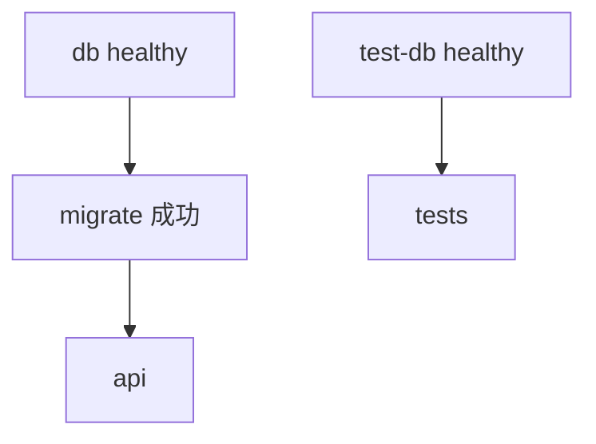

# incident-agent-runtime — V1 Implementation Plan

需求依據：[incident-agent-runtime-docker-proposal.md](incident-agent-runtime-docker-proposal.md)  
階段與 slices：[TDD-Workflow.md](TDD-Workflow.md)

本文件記錄實作時做的決定。各段標明對應 proposal 的章節；之後的決定也記在這裡。

## 1. 現況

新 repo，從零建立（proposal §21）。

## 2. 版本（proposal §5）

查證日期：2026-10-07。Python 套件以 `uv.lock` 為準，下表是鎖定時解析到的版本。

| 項目 | 版本 | 說明 |
|---|---|---|
| Python | 3.12（映像 `python:3.12.15-slim-bookworm`） | `requires-python = ">=3.12,<3.13"` |
| uv | 0.12.23（映像 `astral/uv:0.12.23`） | |
| PostgreSQL | `postgres:17.10-bookworm` | 選 17 而非 18：18 的映像改變了資料目錄掛載方式，17 沿用常見的 `/var/lib/postgresql/data` |
| FastAPI | 0.142.2 | |
| Uvicorn | 0.54.0 | |
| Pydantic | 2.13.5 | |
| pydantic-settings | 2.15.0 | |
| SQLAlchemy | 2.1.3 | 使用 `sqlalchemy[asyncio]` extra；2.1 起 async 需要另外安裝 greenlet |
| psycopg | 3.3.6（binary） | |
| Alembic | 1.20.0 | |
| pytest | 見 `uv.lock` | |
| httpx2 | 2.13.1 | FastAPI / Starlette test client 已建議改用 httpx2，httpx 會出現 deprecation warning |

M2 / M4 加入的依賴：

| 項目 | 版本 | 說明 |
|---|---|---|
| LangGraph | 1.2.14 | |
| langchain-core | 1.6.7 | |
| langchain-ollama | 1.1.0 | 依賴 `ollama` 0.6.3 |
| pytest-asyncio | 1.4.0 | dev |
| Ollama 映像 | `ollama/ollama:0.35.1` | 0.40.0 於查證前一天才發布，選上一個已有 patch 的系列 |
| 預設模型 | `qwen2.5:7b` | 原候選 `llama3.2:3b` 實測無法穩定產生 hypotheses，見 Verification §4 |

映像 digest：待 M5 記錄於 `docs/Verification.md`。

## 3. 待決事項（TDD-Workflow §4）

| # | 決定 | 狀態 |
|---|---|---|
| D1 | 單一輪超過 2 個 tool calls：拒絕，視為 loop-limit 類錯誤（502） | 採用建議，M2 實作 |
| D2 | `title` 上限 200 字元、`description` 上限 5000 字元 | 採用建議，M1 實作 |
| D3 | 具名 exception 分類，由 API 層集中映射 HTTP status | 採用建議，M2 / M3 實作 |
| D4 | Model-init 為 runtime image 內的 Python script，透過 Ollama HTTP API 操作 | 採用建議，M4 實作 |
| D5 | Readiness 比對 DB 中的 Alembic revision 與程式內 head | 採用建議，M4 實作 |
| D6 | 測試 seams | 已由專案負責人確認 |

D1–D5 是依 TDD-Workflow 的建議先採用；如需改變，修改本表與相關測試。

## 4. 與 proposal 寫法不同之處

| 項目 | proposal | 實作 | 理由 |
|---|---|---|---|
| `DATABASE_URL` | §8：由 Compose 組合後傳入 | Compose 傳入 `POSTGRES_*` 與 `POSTGRES_HOST`，由 `Settings.database_url` 以 SQLAlchemy `URL.create` 組合 | §8 要求自訂密碼時正確處理特殊字元；在 Compose 字串插值中無法做 URL escaping |
| Compose 變數 | §14：先 `cp .env.example .env` | Compose 對每個變數提供與 `.env.example` 相同的預設值 | 沒有 `.env` 時（例如 CI）`docker compose config` 與 test profile 仍可解析；README 的步驟不變 |
| Test profile | §18：M5 | M1 建立最小可用版本，M5 補齊 | M1 起就需要真實 PostgreSQL 測試（TDD-Workflow §3） |
| 預設模型 | §8：`llama3.2:3b` | `qwen2.5:7b` | `llama3.2:3b` 實測無法穩定產生 hypotheses（Verification §4）；§8 允許實測後更換 |
| 逾時預設值 | §8：單次請求 120 秒、整體 300 秒 | 單次請求 300 秒、整體 600 秒 | CPU 跑 `qwen2.5:7b` 實測調查耗時 100–223 秒，首次載入模型可能超過 120 秒（Verification §4）；由專案負責人決定 |

README 中「`DATABASE_URL` 由 Compose 組合」的描述，在 M5 文件同步時更新。

## 5. Compose 啟動與測試依賴（proposal §7）

M1 的服務：

- `db`、`test-db`：`pg_isready` healthcheck。
- `migrate` → `api`：`service_completed_successfully`。
- `test-db` 使用 tmpfs，不使用 `postgres_data` volume。
- `api` 只綁定主機 `127.0.0.1:8000`；`db`、`test-db` 不對主機開 port。
- `ollama`、`model-init` 在 M4 加入，屆時 `api` 增加對 `model-init` 的依賴。

## 6. 必須實測才能確認的假設

| 假設 | 何時驗證 |
|---|---|
| `llama3.2:3b` 在選定 Ollama / adapter 版本下能 tool calling | M4 live smoke |
| 同一模型能穩定產生 structured output | M4 live smoke |
| CPU 模式下調查耗時在 `INVESTIGATION_TIMEOUT_SECONDS` 內 | M4，記錄於 Verification |
| 全新 clone 依 README 可在 bash 與 PowerShell 啟動 | M5 |
