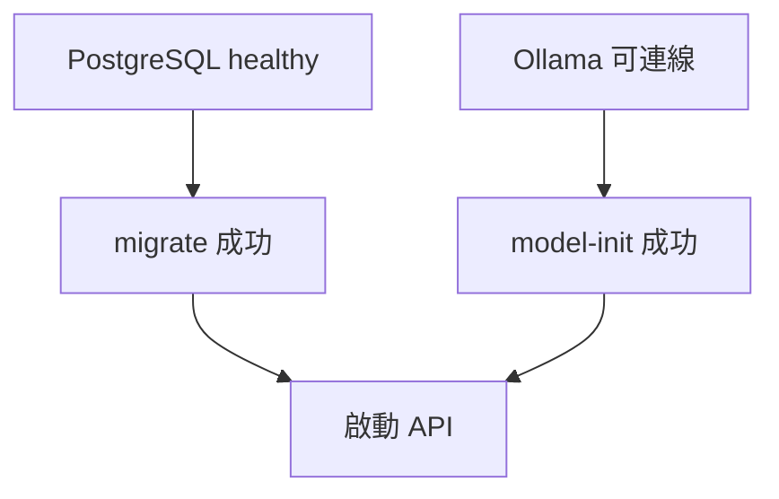
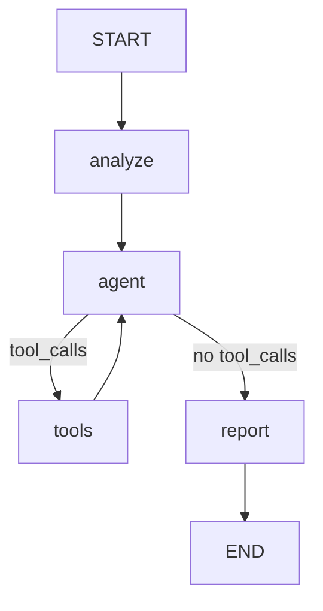

# incident-agent-runtime — V1 Docker Edition Proposal

版本：Draft 1  
日期：2026-09-30  
用途：提供 Codex Agent 規劃與實作 GitHub 公開版本的需求依據。

## 1. 專案定位

incident-agent-runtime 是一個小型事件調查 Agent 應用。使用者提交服務異常描述，Agent 判斷是否需要查詢日誌、呼叫工具收集證據，生成結構化調查報告，並保存事件與報告。

本版沿用 Python + FastAPI + LangGraph + PostgreSQL，將已跑通的本地 V1 整理成可以透過 Docker Compose 啟動、測試與重現的版本。

對外可以簡短描述為：

> 一個可在本機啟動的事件調查 Agent：讀取事件描述、查詢日誌證據，產生並保存可追溯來源的調查報告。

本版日誌來自固定 fixture，展示完整調查流程。報告中的假設與 confidence 是模型產出，不代表根因已被證實。

## 2. 本版目標

1. 使用者只需 Git 與支援 Docker Compose v2 的 Docker 環境，不需在主機安裝 Python、PostgreSQL 或 Ollama。
2. clone 專案、建立設定檔後，使用 `docker compose up --build -d` 啟動完整應用。
3. 首次啟動自動執行資料庫 migration 與模型下載。
4. 透過 Swagger 或 HTTP 完成建立事件、執行調查、查詢報告。
5. PostgreSQL 資料與 Ollama 模型在一般停止、重新建立容器後仍然保留。
6. 預設測試使用 fake model，CI 不需模型、LLM API key 或外部推論服務。
7. 至少在一個已記錄的真實模型與硬體環境上，觀察到完整調查成功。
8. 調查執行與 persistence 分離，保留後續 TypeScript settle 整合的接點。

本文件定義需求與驗收標準，不代表 Docker 組態或模型相容性已經實測。

## 3. 範圍與非目標

### 本版包含

- Python API 與明確撰寫的 LangGraph nodes。
- 單一工具 `query_logs()`。
- 固定日誌 fixture。
- Ollama 模型 adapter。
- Pydantic 結構化報告及證據來源驗證。
- PostgreSQL persistence 與初始 Alembic migration。
- Dockerfile、Compose、資料與模型 volumes。
- deterministic tests、獨立 live-model tests。
- GitHub Actions、README、完整範例與環境驗收紀錄。

### 本版不包含

- TypeScript 協調服務、settle、signal-kernel 整合。
- revision、superseded execution、commit validation。
- RAG、vector database、runbook retrieval。
- 多 Agent、背景工作、Redis、Celery。
- streaming、SSE、WebSocket、frontend。
- authentication、SSO、多租戶。
- 真實 log / metrics 平台與自動修復工具。
- LangSmith / Langfuse 等外部觀測平台。
- 正式環境部署、Kubernetes、production readiness。
- 同一事件並行調查的版本排序或結果採用保證。

V1 驗收以循序調查為主。Docker 化本身不增加 runtime correctness 或並行結果管理能力。

## 4. 使用情境

使用者建立事件：

```json
{
  "title": "Checkout API latency spike",
  "description": "Checkout API latency increased significantly after 14:20."
}
```

Agent 可選擇呼叫：

```python
query_logs(service="checkout")
```

工具回傳：

```text
14:21 checkout-api ERROR database connection timeout
14:22 checkout-api ERROR connection pool exhausted
14:24 checkout-api WARN retrying database request
```

報告範例：

```json
{
  "summary": "Checkout latency may be related to database connection pool exhaustion.",
  "hypotheses": [
    {
      "cause": "Database connection pool exhaustion",
      "confidence": "high",
      "evidence": [
        "14:21 checkout-api ERROR database connection timeout",
        "14:22 checkout-api ERROR connection pool exhausted"
      ]
    }
  ],
  "recommended_next_steps": [
    "Inspect active database connections",
    "Check connection pool configuration"
  ]
}
```

範例描述預期內容與結構，不要求模型逐字產生相同文字。

## 5. 技術選擇

| 部分 | 選擇 | 說明 |
|---|---|---|
| Language | Python 3.12 | 固定 minor version，不以「最新」為前提 |
| Dependency management | uv + uv.lock | 應用、測試與 CI 使用相同 lockfile |
| API | FastAPI + Uvicorn | 調查在 HTTP request 期間完成 |
| Validation | Pydantic v2 + pydantic-settings | API、報告、設定分開驗證 |
| Workflow | LangGraph StateGraph | 自行撰寫 nodes 與 routing |
| Model interface | LangChain chat model interface + Ollama adapter | agent 與 report model 可注入 |
| Database | PostgreSQL | 報告與證據使用 JSONB |
| ORM / driver | SQLAlchemy 2.x + psycopg 3 | 預設採用 AsyncSession |
| Migrations | Alembic | 一個初始 schema migration 即可 |
| Testing | pytest + async test support + HTTP test client | fake model 與真實模型測試分開 |
| Packaging | Dockerfile + Docker Compose v2 | Linux containers，CPU 預設 |
| CI | GitHub Actions | 無模型的自動化驗證 |

規劃 Agent 應查證所選版本的相容性，產生並提交 lockfile。映像使用已查證的固定 release tag；可行時記錄 digest。不要因為套件新版範例不同，就改變本文件的產品需求。

若有既有同步 SQLAlchemy 實作可沿用，規劃階段可以提出保留方案，但必須說明如何避免在 async route 中直接執行阻塞 DB I/O。不可在背景 thread 與 request thread 之間共用同一個 Session。

SQLAlchemy 官方支援透過 `create_async_engine()` 與 `postgresql+psycopg://` 使用 psycopg 的 async dialect，見參考資料 [6]。

## 6. 應用邊界

採用下列責任分工：

| 邊界 | 責任 |
|---|---|
| API routes | HTTP validation、呼叫 application service、映射錯誤 |
| Application service | 載入事件快照、執行 investigator、驗證結果、保存報告 |
| Investigator / graph adapter | 接受 plain input，回傳 report、實際 evidence 與 tool-call 紀錄 |
| Tools | 依參數查詢固定資料，不操作 incident DB |
| Repository | 保存與查詢事件、報告 |
| Composition | 建立設定、模型、工具與 graph，提供 FastAPI dependencies |

核心要求：

- Graph nodes 不直接寫入事件或報告資料表。
- Investigator 不依賴 HTTP request 或 SQLAlchemy ORM objects。
- 輸入與輸出可以用 Pydantic schema 表達並序列化成 JSON。
- LangChain messages 與 LangGraph state 留在 adapter 內部。
- API 可以直接操作普通 schema，不向外暴露框架內部型別。
- 執行調查時不持有長時間資料庫 transaction 或 row lock。

概念介面：

```python
async def investigate(
    incident: InvestigationInput,
) -> InvestigationResult:
    ...
```

`InvestigationResult` 至少包含：

- `report: InvestigationReport`
- `evidence: list[str]`：這次工具實際回傳的日誌。
- `tool_calls`：工具名稱與已驗證參數的簡單紀錄。

本版 API 仍然提供「調查並保存」的完整操作；目前只拆程式責任，不新增遠端 commit API。

## 7. Docker Compose 服務

| Service | 執行方式 | 責任 / 資料 |
|---|---|---|
| `db` | 長期服務 | PostgreSQL，使用 `postgres_data` named volume |
| `ollama` | 長期服務 | Ollama server，使用 `ollama_data` named volume |
| `migrate` | 一次性任務 | 等待 DB healthy，執行 `alembic upgrade head` |
| `model-init` | 一次性任務 | 等待 Ollama 可連線，取得指定模型 |
| `api` | 長期服務 | 等待 migration 與 model-init 成功，啟動 Uvicorn |
| `test-db` | test profile | 隔離的測試 PostgreSQL，不共用應用資料 volume |
| `tests` | test profile，一次性任務 | 使用 test image target 執行 pytest |

Runtime image 不需要 pytest；test target 包含 dev dependencies 與 tests。Runtime image 必須包含 live_smoke 需要的 scripts 與 HTTP client dependencies。

### 啟動相依關係



Compose 的容器啟動與依賴 ready 是不同條件。使用 `service_healthy` 等待 DB，使用 `service_completed_successfully` 等待一次性任務完成，見參考資料 [1]。

### 網路與 ports

- API 容器透過 `db:5432` 連線 DB。
- API / model-init 透過 `http://ollama:11434` 連線 Ollama。
- 容器內的 `localhost` 不能代替其他 Compose service 名稱。
- API 綁定 `0.0.0.0:8000`，主機預設映射到 `127.0.0.1:8000`。
- 預設不向主機公開 DB 與 Ollama ports。
- test profile 不啟動 API 或 Ollama，也不下載模型。

Compose 服務名稱解析與 container ports 的用途，見參考資料 [2]。

### Healthcheck 要求

- DB 使用 `pg_isready`。
- Ollama 可連線檢查不代表指定模型已下載。
- model-init 完成後，必須確認設定的模型可查得；不能只接受 HTTP server alive。
- 探測方法只能依賴映像確實包含的工具；不可假設 Ollama image 一定有 curl。
- API Docker healthcheck 可呼叫 liveness；完整應用驗收另外檢查 readiness。

## 8. 設定與模型初始化

`.env.example` 提供明確的本地開發預設：

```dotenv
POSTGRES_DB=incident_agent
POSTGRES_USER=incident_agent
POSTGRES_PASSWORD=incident_agent_dev

LLM_PROVIDER=ollama
LLM_MODEL=llama3.2:3b
MAX_TOOL_ROUNDS=2
GRAPH_RECURSION_LIMIT=16
INVESTIGATION_TIMEOUT_SECONDS=300
LLM_REQUEST_TIMEOUT_SECONDS=120
```

Compose 組合並傳入應用設定：

```dotenv
DATABASE_URL=postgresql+psycopg://incident_agent:incident_agent_dev@db:5432/incident_agent
OLLAMA_BASE_URL=http://ollama:11434
```

這些 credentials 只用於本機示範；設定檔不提交 Git。若實作支援自訂密碼，組合 URL 時必須正確處理特殊字元。

### 模型選擇

- `llama3.2:3b` 延續原本 proposal，作為初始候選。
- 不預設它已通過本次 Ollama / adapter 版本的 tool calling 與 structured output 驗證。
- 若候選模型無法完成需求，可以在規劃與實測後更換預設，並記錄原因與實際通過版本。
- agent model 與 report model 可以使用相同模型名稱，但透過不同 adapter 呼叫。
- `LLM_PROVIDER` 本版只支援 `ollama`；其他值應在設定驗證時拒絕。

### 初始化行為

- 使用可重複執行的初始化方式。
- 已有模型時可以確認存在後跳過下載；新名稱必須重新初始化。
- 初始化失敗必須以非零 exit code 結束，不得讓 API 宣稱 ready。
- 等待 server、下載及連線重試必須有明確的上限與可理解的錯誤訊息。
- 模型保存在 volume，不在 Docker build 階段下載或打包。
- 首次下載需要網路、時間與足夠磁碟空間。
- 映像、dependencies 與模型已備妥後，調查不需呼叫外部 hosted LLM。
- README 記錄模型名稱、digest、Ollama 版本及驗收硬體；名稱相同不代表權重永遠不變。

預設採用 CPU 模式。GPU override 可在後續加入，不是第一版 DoD。Ollama 官方提供 CPU 與 GPU Docker 執行方式，見參考資料 [3]。

## 9. API 契約

| Endpoint | 成功回應 | 責任 |
|---|---|---|
| `GET /health` | 200 | Process liveness，不呼叫模型 |
| `GET /ready` | 200 / 503 | DB 可用、schema migration 完成、Ollama 可連線且模型存在 |
| `POST /incidents` | 201 | 建立事件 |
| `POST /incidents/{id}/investigate` | 200 | 在 request 期間執行調查並保存 |
| `GET /incidents/{id}` | 200 | 查詢事件與最新已保存報告 |

### POST /incidents

接受非空 `title`、`description`；去除前後空白後驗證。長度上限由 schema 明確設定並寫入 OpenAPI。

```json
{
  "id": 1,
  "title": "Checkout API latency spike",
  "description": "Checkout API latency increased significantly after 14:20.",
  "status": "created"
}
```

### POST /incidents/{id}/investigate

```json
{
  "incident_id": 1,
  "report_id": 1,
  "status": "completed",
  "report": {
    "summary": "...",
    "hypotheses": [],
    "recommended_next_steps": []
  }
}
```

每次成功的循序調查新增一筆報告。調查可以不呼叫工具；固定 checkout 示範則必須觀察到 `query_logs(service="checkout")` 的真實呼叫。

### GET /incidents/{id}

回傳事件資訊與 `latest_report`；尚未有成功報告時為 `null`。已保存報告至少包含 report ID、時間、report、collected evidence 與 tool-call 紀錄，方便查看證據來源。

latest 的規則固定為該事件最大 report ID 的已提交報告。它代表保存順序，不代表輸入 revision 或並行調查的有效性。

### 錯誤回應

沿用 FastAPI `{"detail": "..."}`：

| 狀況 | HTTP |
|---|---|
| 事件不存在 | 404，`Incident not found` |
| request validation 失敗 | 422 |
| readiness 不足 | 503 |
| 預期 provider failure、invalid structured output、grounding violation、未知工具 / 無效工具參數、loop limit | 502 |
| 調查 deadline 超過 | 504 |
| 非預期程式錯誤、未分類 DB failure | 500 |

不要用廣泛的 `except Exception` 把所有錯誤改成 provider failure。回應不暴露 credentials 或完整 stack trace。

## 10. LangGraph Workflow



### analyze

- 建立 incident context 與初始 messages。
- 可提供可能的 service 作為 prompt context。
- 不用程式分支假裝模型選擇了工具參數。
- 本版不為 analyze 額外增加必要的 LLM 呼叫。

### agent

- 綁定 `query_logs`。
- 決定是否查詢、選擇參數，或結束證據收集。
- 不產生最終 structured report。

### tools

- 使用 repository 自己持有的小型 registry dispatch。
- 驗證名稱與參數。
- 執行 read-only fixture 查詢。
- 每個 tool call 都有匹配的 ToolMessage / tool_call_id。
- 記錄本次實際 evidence 與 call metadata。
- evidence 去除完全相同的重複行，保留順序。

### report

- 使用事件描述與實際 evidence 生成 Pydantic report。
- 使用獨立的 structured-output 呼叫，不綁工具。
- 不寫 DB。

### 控制流程限制

- Nodes 使用 `async def`；由 `ainvoke` 驅動。
- `MAX_TOOL_ROUNDS=2` 是最多進入 tools node 兩次。
- 另外限制每輪最多兩個 tool calls，避免一輪無上限展開。
- `GRAPH_RECURSION_LIMIT=16` 是 graph step 防護，不等於 tool rounds。
- 完成上限輪數後，如果模型仍要求工具，明確回報 loop-limit failure。
- 不得直接跳到 report，留下未配對的 tool calls。
- 設定整體調查 deadline 與單次 provider request timeout。
- V1 不做無上限重試、自動修復 loop 或自動更換模型。
- 每次 invocation 的 state 獨立；不得共用可變 messages / evidence。
- 明確使用 reducers 或完整 state replacement，避免 message 重複附加。

StateGraph、conditional edges 與 recursion limit 的框架語意，見參考資料 [5]。

## 11. Tool 與資料來源

本版只提供：

```python
query_logs(
    service: str,
    keyword: str | None = None,
) -> list[str]
```

`data/logs.json`：

```json
{
  "checkout": [
    "14:21 checkout-api ERROR database connection timeout",
    "14:22 checkout-api ERROR connection pool exhausted",
    "14:24 checkout-api WARN retrying database request"
  ],
  "payment": [
    "15:01 payment-api ERROR upstream timeout",
    "15:02 payment-api WARN retry request"
  ]
}
```

行為：

- service 找不到時回傳空清單。
- keyword 使用已文件化的 case-insensitive substring filter。
- 沒有 keyword 時回傳該 service 的全部固定日誌。
- keyword 只篩選日誌，不執行 SQL、shell 或任意程式碼。
- fixture 路徑相對於應用資源位置，不依賴呼叫時 cwd。
- 資料在 image 中可用，不依賴使用者主機上的檔案。

## 12. 報告 schema 與 grounding

```python
class Hypothesis(BaseModel):
    cause: str
    confidence: Literal["low", "medium", "high"]
    evidence: list[str]


class InvestigationReport(BaseModel):
    summary: str
    hypotheses: list[Hypothesis]
    recommended_next_steps: list[str]
```

本版新增一個明確規則：

> 每個 hypothesis 的 evidence 字串，必須完整匹配這次工具實際回傳的某一行日誌。

採用 exact line matching，暫不支援自由改寫的 evidence。範例與 prompt 也應使用完整行。

- Pydantic validation 驗證結構。
- 應用層 grounding validation 驗證來源。
- 被 keyword 排除、未查詢 service 的日誌，不能被引用。
- 事件描述不是 tool evidence，不能放進 evidence 欄位冒充工具結果。
- 沒有工具證據時允許 `hypotheses=[]`，仍需清楚摘要與下一步。
- 若模型引用未取得的 evidence，回報 502，不默默刪除或修補。
- schema 合法、引用存在，不代表假設在語意上一定正確。
- confidence 不作為客觀評分或正確性保證。

## 13. Persistence

### incidents

| 欄位 | 用途 |
|---|---|
| id | 主鍵 |
| title | 事件名稱 |
| description | 事件描述 |
| status | `created` 或 `completed` |
| created_at | UTC timestamp |
| updated_at | UTC timestamp |

### investigation_reports

| 欄位 | 用途 |
|---|---|
| id | 主鍵 |
| incident_id | Foreign key + index |
| report_json | 完整 validated report，JSONB |
| evidence_json | 實際取得的 evidence，JSONB |
| tool_calls_json | 工具名稱與 validated args，JSONB |
| model_name | 本次模型名稱 |
| created_at | UTC timestamp |

report summary 可從 report_json 取得，無需另建重複欄位。

### Transaction 行為

1. 短 transaction 載入事件，轉成 input snapshot，關閉 session。
2. 在 DB transaction 外執行調查。
3. 完成 schema / grounding 驗證後，以新的短 transaction 保存報告並更新事件 status。
4. 報告 insert 與 status 更新一起 commit 或 rollback。
5. 調查失敗不新增成功報告，不改掉既有成功報告。
6. 第一次調查失敗時，事件仍為 created；已有報告的事件失敗時仍為 completed。
7. 不增加 investigating / failed lifecycle、crash recovery 或 execution history 系統。

初始化使用 Alembic；runtime startup 不另外呼叫 `metadata.create_all()`。Migration 失敗時阻止 API 啟動。

## 14. 啟動、關閉與重啟

### Quick start

```bash
git clone <repository-url>
cd incident-agent-runtime
cp .env.example .env
docker compose up --build -d
```

Windows PowerShell：

```powershell
Copy-Item .env.example .env
docker compose up --build -d
```

然後：

```bash
docker compose ps -a
docker compose logs -f model-init
curl -f http://localhost:8000/ready
```

開啟：

`http://localhost:8000/docs`

以上為實作必須支援的目標介面；repository URL 與模型等待時間由實作後 README 填入。API 在初始化完成前可能尚未監聽，README 要提供初始化狀態的判讀方式。

### 日常停止與恢復

```bash
docker compose down
docker compose up -d
```

DB 與模型 named volumes 保留；重新執行 migration 與 model-init 不破壞資料。

### 設定更換

模型名稱改變後，README 應提供明確重新初始化步驟，確認新模型存在，再重新啟動 / recreate API。不要聲稱已存在的初始化容器一定會自動感知所有 env 變動。

### Reset

README 可以另外提供 `docker compose down -v` 作為清空本地環境的方法，並明確說明它會刪除資料庫與模型 volumes。一般重啟與 smoke test 不使用此指令。

## 15. Testing Strategy

測試分成「不使用真實模型」與「真實模型驗收」，不要把模型是否剛好選到同一段文字當成程式正確性的判定。

### Tier 1：工具與 schemas

- 已知 / 未知 service。
- keyword filtering。
- valid / invalid report。
- grounding 接受實際回傳的完整日誌。
- grounding 拒絕虛構、未查詢或被排除的證據。
- 無證據時的合法報告。

### Tier 2：Graph control flow

注入 scripted fake model 與 fake tool registry，透過 compiled graph invocation 觀察：

- tool_calls routes to tools。
- no tool_calls routes to report。
- ToolMessage 配對與返回 agent。
- evidence 累積。
- 多輪呼叫、未知工具、invalid args。
- tool round / call cap 與 graph recursion limit。
- structured-output failure 與 deadline。
- 每次 invocation 的 state 隔離。

不要逐字測 prompt，也不要逐一 mock 私有 node。

### Tier 3：API + 真實 PostgreSQL

- create → investigate → retrieve。
- DB persistence 與 latest report。
- 循序重複調查保留歷史報告。
- 404、422、502、504。
- 失敗不覆蓋既有成功報告。
- 透過新的 session / application instance 仍能查到結果。
- application composition wiring：只替換外部模型 adapter，不繞過 production graph factory。
- 初始 migration 在乾淨 DB 上成功，第二次執行不破壞資料。

使用獨立 test-db；不可用 application database，也不可用 SQLite 取代 PostgreSQL JSONB 整合測試。

### Tier 4：Live model scenario

使用 `@pytest.mark.llm`，並在 pytest 設定中排除預設執行；獨立 live suite 必須能明確覆寫預設 marker 選擇。

固定 checkout 情境觀察：

- 真實模型呼叫 `query_logs(service="checkout")`。
- report schema 合法。
- hypotheses 至少一個，recommended_next_steps 非空。
- 所有 evidence 完整匹配實際工具結果。
- API 保存成功，GET 取回相同 report。
- 人工確認假設與資料相關；不要求逐字文字或特定英文關鍵字。

Live tests 可以回報這次的 pass / fail，但不作預設 CI gate。一次成功是端到端可行性的證據，不代表之後每次推論都會成功。反覆跑的成功率可另做 eval；本版不要求建立 eval framework。

### 指令契約

以下指令必須由實作提供並實測：

```bash
docker compose --profile test run --build --rm tests pytest -m "not llm"
```

- tests service 依賴 test-db ready。
- test setup 在 isolated database 執行 migrations。
- 不啟動 Ollama、不下載模型、不需要 LLM API key。
- 安裝 / image build 可能需要網路；測試執行階段允許內部 PostgreSQL 連線，禁止未授權 provider 網路呼叫。
- 不把「無外部 LLM」寫成「完全無 network」。

真實模型場景：

```bash
docker compose exec api python -m scripts.live_smoke
```

`scripts.live_smoke` 是需要實作的 HTTP smoke client，透過 API 建立事件、調查、取回並驗證。不需在 runtime image 安裝 pytest。完整 pytest llm suite 的獨立執行方式由實作提供，不得誤用預設的 fake adapter。

Recorded provider response replay 可日後補上，本版不強制 vcrpy 或錄製 cassettes。

## 16. GitHub Actions

PR / push 的最低 gates：

1. lockfile consistency。
2. deterministic unit / graph tests。
3. 真實 PostgreSQL 的 API tests。
4. runtime image build 成功。
5. migration 啟動檢查與不含模型的容器 smoke check。
6. `docker compose config` 驗證。

CI 不 pull / invoke LLM，不需要 provider key。CI image build 與安裝 dependencies 可以使用網路。

API 容器 smoke check 可用獨立 CI Compose override / profile，略過模型初始化，只測 liveness 與基本 incident API。不得把這個模式當成完整 investigation ready。

CI 所需 artifacts 至少包含失敗 log。未實際執行的檢查不得標成 passed。

## 17. 建議 Repository 結構

| 路徑 | 用途 |
|---|---|
| app/main.py | FastAPI composition / lifespan |
| app/config.py | Settings |
| app/api/incidents.py | Incident routes |
| app/api/health.py | Liveness / readiness |
| app/services/investigation.py | 執行、驗證與保存流程 |
| app/agent/graph.py | LangGraph factory |
| app/agent/state.py | Internal state |
| app/agent/models.py | Ollama adapters |
| app/tools/logs.py | query_logs |
| app/schemas/ | Input、report、HTTP output |
| app/db/ | Sessions、ORM models、repositories |
| migrations/ | Alembic revisions |
| data/logs.json | 固定日誌 |
| tests/ | Fakes、unit、graph、API、live-model tests |
| scripts/ | Model init、live smoke helpers |
| .github/workflows/ci.yml | CI |
| Dockerfile | Runtime / test targets |
| compose.yaml | 主啟動與 test profile |
| .dockerignore | 排除 .env、.venv、Git、暫存檔 |
| .env.example | 本機預設設定 |
| pyproject.toml / uv.lock | 依賴 |
| alembic.ini | Migration 設定 |
| README.md | 啟動、使用、測試、問題排查 |
| docs/Proposal.md | 本文件 |
| docs/ImplementationPlan.md | Agent 產出的實作計畫 |
| docs/Verification.md | 已完成驗證與環境紀錄 |

結構是建議，Agent 可沿用既有 repo 的合理結構。不要為了符合名稱而大規模搬移已可用的程式。

## 18. 開發順序與里程碑

| 階段 | 工作 | 驗收 |
|---|---|---|
| M0 | 檢查既有程式 / 新 repo、確認 dependencies 與服務策略 | ImplementationPlan 可對應本 proposal |
| M1 | FastAPI、settings、runtime image、db、migration | 乾淨 DB migration、health、create / get 可用 |
| M2 | Tool、schemas、fake models、graph loop | Deterministic graph / grounding tests 通過 |
| M3 | Application service、investigate endpoint、persistence | Fake model 完成 API vertical slice |
| M4 | Ollama、model-init、readiness、timeouts | 乾淨模型 volume 初始化成功；live scenario 實際跑通 |
| M5 | Test profile、CI、README、Verification | 全新 clone 重現與 restart persistence 通過 |

先完成無模型的 vertical slice，再驗證真實模型，避免用 provider 推論掩蓋 routing / persistence 問題。

uv image 安裝應以 lockfile 為準，runtime 不在啟動時重新解析依賴；主機 .venv 不進 image。官方 Docker integration 指南見參考資料 [4]。

## 19. Definition of Done

### 可重現啟動

- [ ] 新環境僅需 Git + Docker / Compose。
- [ ] README 同時提供 shell 與 PowerShell 建立 env 的方式。
- [ ] `docker compose up --build -d` 自動建立 schema、下載模型。
- [ ] migrate / model-init 成功結束，api / db / ollama 正常。
- [ ] /ready 會正確反映依賴不足，且不執行推論。
- [ ] 首次下載、失敗與重試方式可從 README 理解。
- [ ] 固定映像版本與 uv.lock 已提交。

### 完整應用流程

- [ ] 建立 incident。
- [ ] 真實 graph / model 執行調查。
- [ ] checkout 場景真的呼叫 query_logs。
- [ ] report schema 與 grounding 通過。
- [ ] 報告、evidence、tool-call metadata 保存。
- [ ] GET 回傳最新報告與來源。
- [ ] down / up 後既有事件與報告仍存在。
- [ ] Ollama 模型不因一般容器重建而遺失。

### 測試與文件

- [ ] 預設測試無真實模型、無 API key。
- [ ] API tests 使用隔離的 PostgreSQL。
- [ ] Error / loop-limit / timeout 行為有 deterministic coverage。
- [ ] GitHub Actions 必要 gates 通過。
- [ ] 至少一個 live scenario 成功紀錄。
- [ ] Verification 記錄 OS、CPU / GPU、RAM、Docker / Compose、映像 / 套件版本、模型名稱 / digest、初始化與調查耗時。
- [ ] 已執行、未執行、受環境限制的驗證清楚分開。

Docker 啟動成功、fake-model tests 通過、live-model scenario 成功，是三個不同驗收項目。

## 20. 後續 settle 整合方向

本節解釋本版保留的邊界，不納入 V1 實作。

可能的下一階段：

- TypeScript + settle 接收事件更新並管理 revision / obligations。
- Python investigator 作為可透過 HTTP 呼叫的執行服務。
- Python 回傳候選 report 與 evidence。
- 由具備版本權威的層決定結果採用。

目前先做到 investigator 與 repository 分離。不要增加空的 TypeScript package、revision 欄位、commit endpoint 或假設尚未確認的 settle API。

後續接入前必須另寫設計：

1. revision 的來源與持久化責任。
2. execute / publish HTTP 契約。
3. 結果採用時的原子版本驗證。
4. superseded 與取消執行的區別。
5. 歷史報告保存與目前有效報告的區別。

先檢查 revision、再另外發送保存請求，不能單獨保證不會發生競態。本版保留接點，不宣稱已解決。

## 21. 給 Codex Agent 的規劃指令

可以將以下文字與本 proposal 一起交給 Agent：

> 請以本 proposal 為需求依據，先規劃 incident-agent-runtime 的 V1 Docker Edition。
>
> 如果 repo 有既有程式，先讀 AGENTS.md、README、dependencies、application composition、graph、DB 與 tests，確認實際行為；不要只依檔案名稱或舊 proposal 猜測。若是新 repo，明確以從零建立計畫。
>
> 請先產出 docs/ImplementationPlan.md，包含現況摘要、可沿用 / 需調整項目、相容版本選擇、Compose startup / test dependency 設計、分階段實作 checklist、各階段驗收指令，以及需要實測才能確認的假設。
>
> 保留 Python + LangGraph、單工具、固定日誌、Ollama 與 PostgreSQL。不得自行擴充 frontend、RAG、多 Agent、settle、背景工作或 production deployment。
>
> 規劃必須區分 deterministic tests 與 live-model verification。真實模型的 tool calling / structured output 能力與 Docker 冷啟動不可僅靠推論宣告成功。
>
> 本次先完成規劃，不直接開始程式實作。若發現 proposal 有衝突或無法達成的假設，列出具體證據與最小修改建議。

## 22. 官方參考資料

以下連結用於查證框架與 Docker 行為；本 proposal 的範圍、timeout 值與里程碑屬專案設計選擇。

1. [Docker Compose — Startup order](https://docs.docker.com/compose/how-tos/startup-order/)
2. [Docker Compose — Networking](https://docs.docker.com/compose/how-tos/networking/)
3. [Ollama — Docker](https://docs.ollama.com/docker)
4. [uv — Using uv in Docker](https://docs.astral.sh/uv/guides/integration/docker/)
5. [LangGraph — Graph API overview](https://docs.langchain.com/oss/python/langgraph/graph-api)
6. [SQLAlchemy — PostgreSQL / psycopg dialect](https://docs.sqlalchemy.org/en/20/dialects/postgresql.html)
7. [Ollama — List models](https://docs.ollama.com/api/tags)

